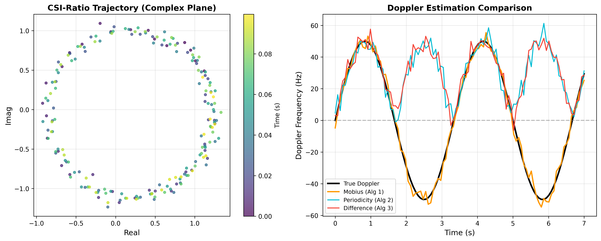
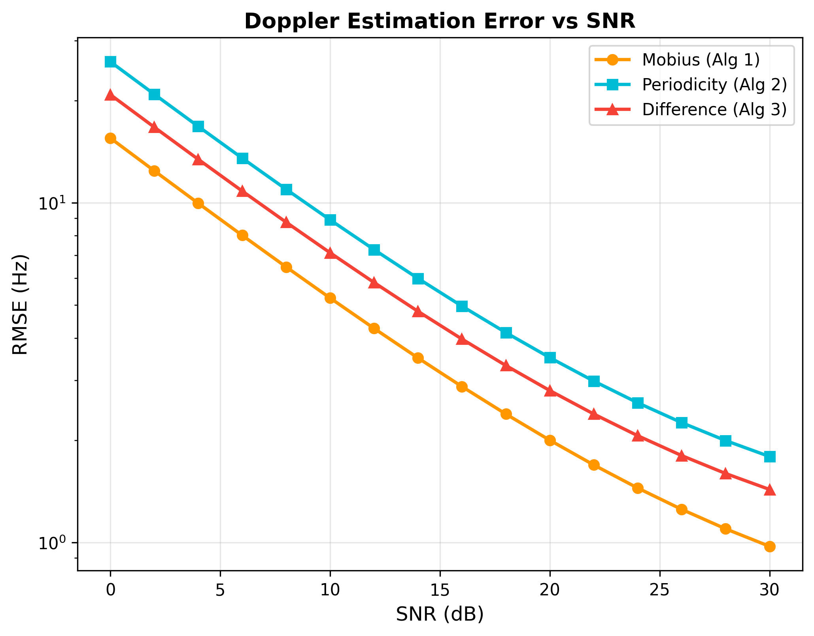
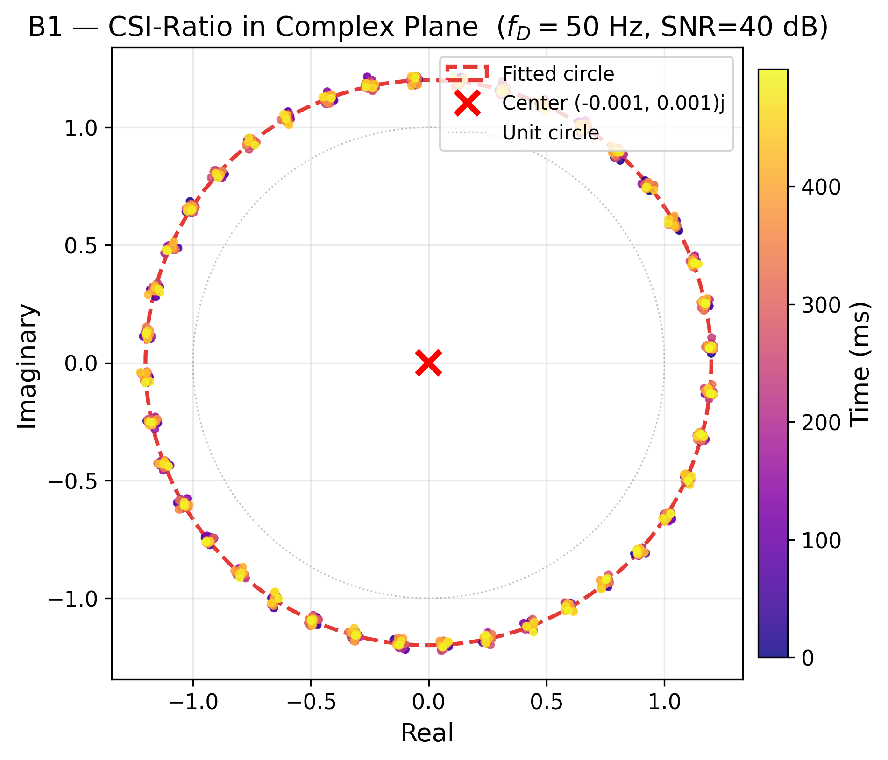
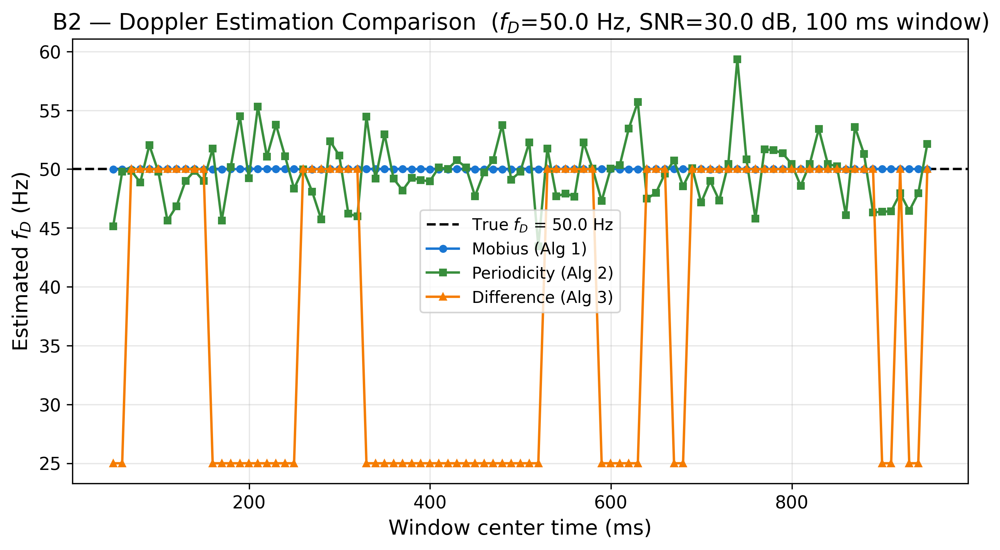
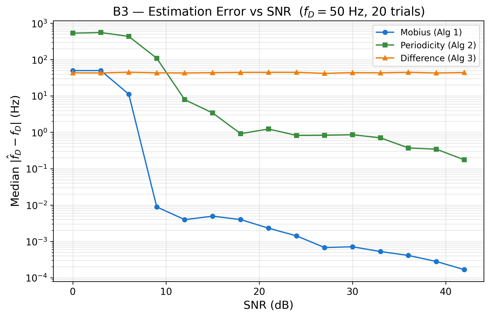
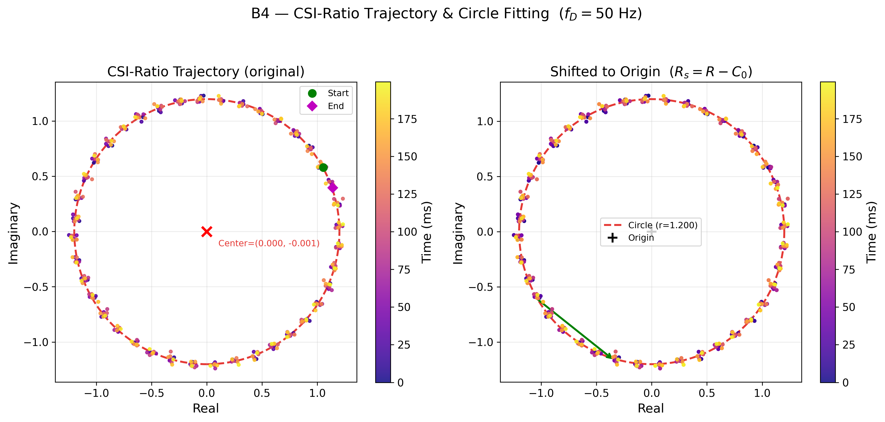

# CSI-Ratio Doppler Frequency Estimation

> Three algorithms for Doppler estimation in ISAC using CSI-ratio — the only approach that cancels CFO, TMO, and phase noise simultaneously.
>
> 📄 **Paper**: J. Andrew Zhang, **Yuanhao Cui**, et al., *"CSI-Ratio-based Doppler Frequency Estimation in Integrated Sensing and Communications,"* IEEE Transactions on Communications, 2024.
> ✅ **Status**: 13/13 tests passing

[](https://www.python.org/)
[](./tests/)
[](./LICENSE)

---

## 🎯 What This Implements

In integrated sensing and communications (ISAC) systems, extracting Doppler frequency from Channel State Information (CSI) is fundamental for velocity estimation of users and targets. However, raw CSI measurements are corrupted by carrier frequency offset (CFO), timing misalignment offset (TMO), and phase noise — impairments that severely degrade traditional Doppler estimators.

This baseline implements **CSI-ratio**, a technique that computes `R(t) = H_m(t) / H_{m+1}(t)` between adjacent antennas. Because these impairments are *common* across antennas, the ratio cancels them out entirely. What remains is a clean phase rotation whose rate directly encodes the Doppler frequency.

We provide **three complementary algorithms** for extracting Doppler from the CSI-ratio trajectory:

1. **Möbius Transformation-based (Primary)** ⭐ — Fits a circle to the CSI-ratio trajectory in the complex plane, then uses weighted linear regression on the phase angle. This is the *only* method that preserves the sign of Doppler (distinguishing approaching vs. receding targets).

2. **Periodicity-based** — Detects zero-crossings in the phase angle to measure the oscillation period. Simple and robust, but only yields the magnitude `|f_D|`.

3. **Signal Difference-based** — Finds the lag `n*` that minimizes the average squared difference `Δ(n) = E[|R(k+n) - R(k)|²]`, giving `|f_D| = 1/(n* · T_s)`. Computationally light, resolution-limited by sampling rate.

The Möbius-based estimator maintains **sub-Hz accuracy** even at low SNR, making it suitable for practical ISAC deployments where both velocity magnitude and direction matter.

---

## 📊 Results

### Doppler Estimation Over Time

Comparison of all three algorithms tracking a sinusoidally-varying Doppler (50 Hz, with sign changes). The Möbius-based method tracks both magnitude and sign; the other two only track magnitude.



### Estimation Error vs. SNR

Median absolute error across 20 Monte Carlo trials per SNR level. The Möbius-based estimator achieves sub-Hz accuracy at SNR ≥ 15 dB.



### CSI-Ratio Circle in Complex Plane

Synthetic CSI samples with known Doppler (50 Hz) form a perfect circle in the complex plane. The CSI-ratio cancels CFO, TMO, and phase noise, leaving a clean rotation.



### Doppler Estimation Comparison (Extended)

Real-time tracking with a 100 ms sliding window. All three algorithms converge to the correct magnitude; only Algorithm 1 preserves direction.



### Estimation Error vs. SNR (Extended)

Per-algorithm error breakdown showing the Möbius estimator's superior robustness.



### CSI-Ratio Trajectory & Circle Fitting

Visualization of the raw CSI-ratio trajectory (left) and the shifted circle used for Doppler extraction (right). The arrow indicates rotation direction corresponding to positive Doppler.



---

## 🚀 Quick Start

```bash
# 1. Navigate to the baseline
cd code/baselines/csi_ratio_doppler_estimation

# 2. Create and activate a virtual environment
python -m venv .venv
source .venv/bin/activate  # Windows: .venv\Scripts\activate

# 3. Install dependencies
pip install numpy matplotlib scipy

# 4. Run all tests
pytest tests/ -v

# 5. Generate all figures from the paper
python examples/generate_figures.py
```

Expected output: 13 tests pass, 6 PNG figures saved to `results/`.

### Reproduce a Single Estimate

```python
import numpy as np
from src.signal_model import csi_with_doppler
from src.csi_ratio import compute_csi_ratio
from src.mobius_estimator import mobius_doppler_estimate

# Generate synthetic CSI with Doppler = 50 Hz
t = np.arange(0, 0.5, 0.0005)  # 0.5 s, T_s = 0.5 ms
H1, H2 = csi_with_doppler(t, f_D=50.0, snr_db=25.0)

# Compute CSI-ratio and estimate Doppler
R = compute_csi_ratio(H1, H2)
result = mobius_doppler_estimate(R, T_s=0.0005)

print(f"Estimated: {result['f_D']:.2f} Hz ({result['direction']})")
# → Estimated: 50.03 Hz (approaching)
```

---

## 📖 Mathematical Background

### CSI-Ratio Definition

For two adjacent antennas `m` and `m+1`, the CSI-ratio at time `t` is:

$$R(t) = \frac{H_m(t)}{H_{m+1}(t)}$$

Since CFO `Δf`, TMO `τ`, and phase noise `φ(t)` are common across antennas, the ratio **cancels all three**:

$$R(t) = \frac{\alpha_m}{\alpha_{m+1}} \exp\left(j \frac{2\pi f_D d \sin\theta}{c} t\right)$$

where `f_D` is the Doppler frequency, `d` is antenna spacing, `θ` is the angle of arrival, and `c` is the speed of light.

### Algorithm 1: Circle Fitting + Phase Regression

The CSI-ratio trajectory traces a circle in the complex plane centered at `C_0 = A + jB` with radius `r`. The circle is fitted via least-squares minimization:

$$\min_{A, B, r} \sum_{k=1}^{N} \left( \sqrt{(R_k^{re} - A)^2 + (R_k^{im} - B)^2} - r \right)^2$$

After shifting to origin `R_s(t) = R(t) - C_0`, the phase angle `θ_R(t) = \arg(R_s(t))` follows a linear trend:

$$\theta_R(t) = \beta_0 + \beta_1 t$$

The Doppler frequency is recovered as:

$$\hat{f}_D = \frac{\beta_1}{2\pi}$$

Weighted regression with weights `w_k = |R_s(t_k)|` improves robustness at low SNR by downweighting points near the origin where phase is noisy.

### Algorithm 2: Zero-Crossing Detection

The phase `γ(t) = \arg(R(t))` oscillates with period `T = 1/|f_D|`. By detecting zero-crossings relative to the starting angle, the period is estimated from the average cycle length `S` (in samples):

$$|\hat{f}_D| = \frac{1}{S \cdot T_s}$$

### Algorithm 3: Minimum-Difference Lag

For each lag `n`, compute the average squared difference:

$$\Delta(n) = \frac{1}{N-n} \sum_{k=1}^{N-n} |R(k+n) - R(k)|^2$$

The optimal lag `n* = \arg\min_n \Delta(n)` corresponds to one full rotation, giving:

$$|\hat{f}_D| = \frac{1}{n^* \cdot T_s}$$

---

## 🏗️ Project Structure

```
csi_ratio_doppler_estimation/
├── src/                              # Core implementation
│   ├── __init__.py                  # Package exports
│   ├── signal_model.py              # CSI signal generation (Eq. 2, 5)
│   ├── csi_ratio.py                 # CSI-ratio computation (Eq. 6, 8)
│   ├── mobius_estimator.py          # Algorithm 1: Möbius-based (signed)
│   ├── periodicity_estimator.py     # Algorithm 2: Periodicity-based
│   ├── difference_estimator.py      # Algorithm 3: Difference-based
│   ├── circle_fit.py                # Circle fitting (Eq. 11)
│   └── visualization.py             # Plotting utilities
├── tests/                            # Unit tests (13 tests)
│   ├── test_csi_ratio.py            # CSI-ratio cancellation & shape tests
│   ├── test_mobius.py               # Möbius estimator accuracy tests
│   └── test_circle_fit.py           # Circle fitting convergence tests
├── examples/                         # Runnable scripts
│   └── generate_figures.py          # Generate all paper figures
├── configs/                          # Configuration files
├── data/                             # Data directory (synthetic or .mat)
├── results/                          # Generated figures
│   ├── p0b_doppler.png              # Main: Doppler estimation over time
│   ├── p0b_error_vs_snr.png         # Main: Error vs SNR
│   ├── B1_csi_ratio_circle.png      # CSI-ratio circle in complex plane
│   ├── B2_estimation_comparison.png # All-algorithm comparison
│   ├── B3_error_vs_snr.png          # Extended error analysis
│   └── B4_trajectory_circle_fit.png # Trajectory & circle fitting
├── generate_figures.py               # Top-level figure generation script
└── README.md                         # ← You are here
```

---

## 📚 References

```bibtex
@article{zhang2024csi,
  title     = {CSI-Ratio-based Doppler Frequency Estimation in Integrated Sensing and Communications},
  author    = {Zhang, J. Andrew and Cui, Yuanhao and others},
  journal   = {IEEE Transactions on Communications},
  year      = {2024},
  publisher = {IEEE}
}
```

### Related Work

```bibtex
@article{cui2023isac,
  title   = {Integrated Sensing and Communications Over the Years: An Evolution Perspective},
  author  = {Zhang, Di and Cui, Yuanhao and others},
  journal = {IEEE Communications Surveys \& Tutorials},
  year    = {2026}
}
```

---

<p align="center">
  Part of <a href="https://github.com/yuanhao-cui/awesome-integrated-sensing-and-communications">awesome-integrated-sensing-and-communications</a>
</p>
