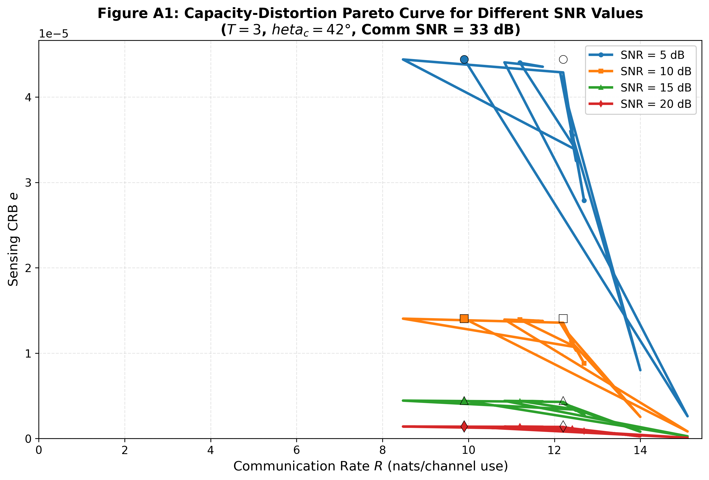
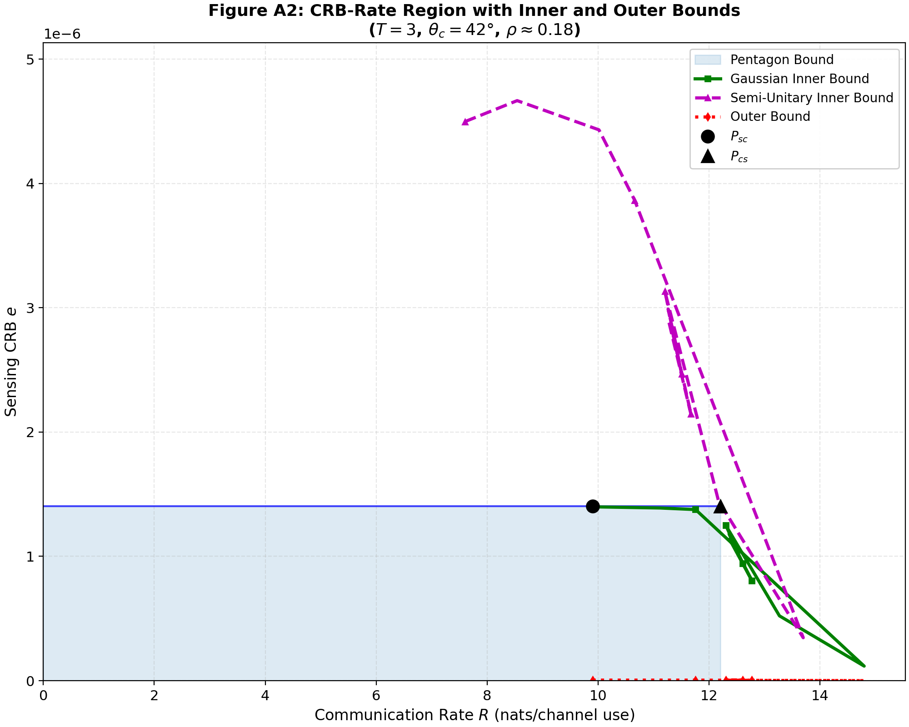
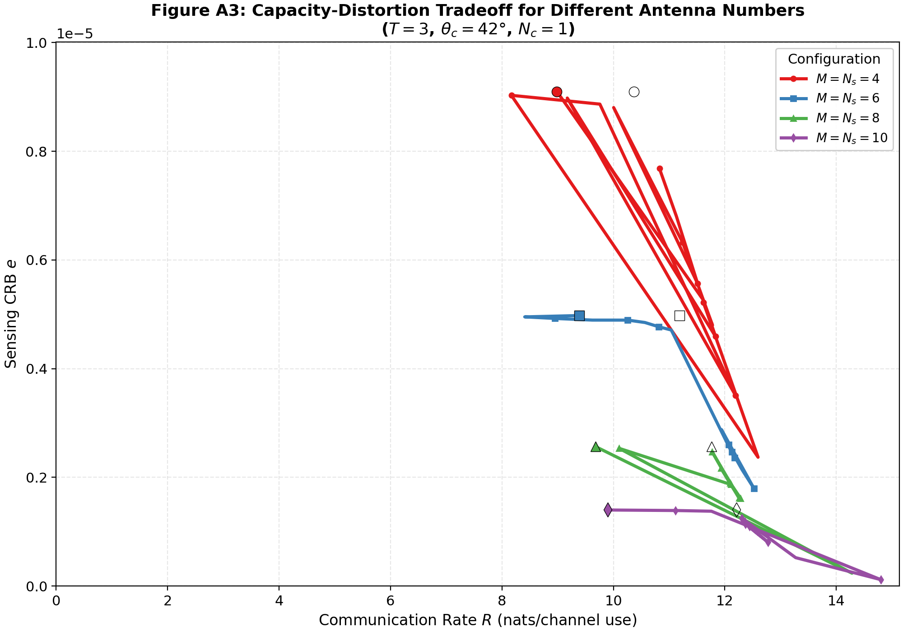

# ISAC Capacity-Distortion Tradeoff Baseline


Implementation of the fundamental CRB-rate region analysis for Integrated Sensing and Communications (ISAC) under Gaussian channels, establishing the theoretical boundaries for capacity-distortion tradeoffs.

## Reference Paper

> **"On the Fundamental Tradeoff of Integrated Sensing and Communications Under Gaussian Channels"**  
> Yifeng Xiong, Fan Liu, Yuanhao Cui, Wei Yuan, et al.  
> *IEEE Transactions on Information Theory, 2023*  
> [arXiv:2204.06938](https://arxiv.org/abs/2204.06938) | [IEEE Xplore](https://ieeexplore.ieee.org/document/10146036)

---

## 🚀 Quick Start

```bash
# Clone the repository
git clone https://github.com/yuanhao-cui/awesome-integrated-sensing-and-communications.git
cd awesome-integrated-sensing-and-communications/code/baselines/isac_capacity_distortion

# Create virtual environment and activate
python -m venv .venv
source .venv/bin/activate

# Install requirements
pip install -r requirements.txt

# Run a quick demo
python examples/demo.py

# Generate the main Pareto and bound figures
python examples/generate_figures.py --figures all
```

---

## 📊 Results

The simulation scripts generate the following key results demonstrating the ISAC capacity-distortion tradeoffs:

### Figure A1: Capacity-Distortion Pareto Curve for Different SNR Values
Illustrates how the fundamental tradeoff between communication rate and sensing CRB varies with sensing SNR. 

<div align="center">
  
</div>

### Figure A2: CRB-Rate Region with Inner and Outer Bounds
Demonstrates the complete achievable region with Pentagon, Gaussian, and Semi-Unitary inner bounds, alongside the theoretical outer bound and optimal corner points ($P_{sc}$ and $P_{cs}$).

<div align="center">
  
</div>

### Figure A3: Tradeoff Curves for Different Antenna Numbers
Shows how increasing the number of transmit and sensing receive antennas expands the achievable CRB-Rate region.

<div align="center">
  
</div>

---

## 📖 Overview

This baseline implements the fundamental tradeoff between sensing quality (measured by Bayesian Cramér-Rao Bound, BCRB) and communication rate (measured in nats/channel use) for point-to-point ISAC systems under Gaussian channels.

### Key Concepts

1. **CRB-Rate Region:** The set of all achievable pairs $(e, R)$ where $e$ is the BCRB and $R$ is the communication rate.
2. **Two-Fold Tradeoff:**
   - **Subspace Tradeoff (ST):** Arises from resource allocation between sensing and communication subspaces.
   - **Deterministic-Random Tradeoff (DRT):** Arises from the choice between deterministic (sensing-optimal) and random (communication-optimal) waveform structures.
3. **Corner Points:**
   - **$P_{sc} = (e_{min}, R_{sc})$:** Sensing-constrained capacity point.
   - **$P_{cs} = (e_{cs}, R_{max})$:** Communication-constrained minimum CRB point.

---

## 🛠️ API Reference

### `src.system_model`
Core channel models and metric computations.

| Function | Description |
|----------|-------------|
| `GaussianISACChannel` | Class representing the combined Gaussian ISAC channel |
| `compute_bfim` | Computes the Bayesian Fisher Information Matrix (BFIM) |
| `compute_crb` | Computes the Bayesian CRB $= \text{tr}\{J^{-1}\}$ |
| `compute_rate` | Computes ergodic communication rate |
| `compute_phi_angle` | Computes $\Phi(R_x)$ for angle estimation |
| `angle_to_channel` | Creates LoS MIMO channel for a given angle |
| `make_uniform_linear_array` | Creates a ULA steering vector function |

### `src.optimization`
Convex optimization routines for covariance matrix design.

| Function | Description |
|----------|-------------|
| `optimize_sensing_rx` | Finds sensing-optimal covariance (pure sensing) |
| `optimize_comm_rx` | Finds communication-optimal covariance (water-filling) |
| `covariance_shaping` | Solves fundamental tradeoff optimization (Eq. 48) |
| `stiefel_sample` | Generates semi-unitary matrix from Stiefel manifold |

### `src.bounds`
Theoretical and achievable bounds computation.

| Function | Description |
|----------|-------------|
| `pentagon_inner_bound` | Computes time-sharing boundary between corner points |
| `gaussian_inner_bound` | Computes achievable region using Gaussian signaling |
| `semi_unitary_inner_bound`| Computes achievable region using Stiefel manifold sampling |
| `outer_bound` | Computes theoretical performance limits |
| `compute_corner_points` | Finds $P_{sc}$ and $P_{cs}$ extreme points |

---

## 📁 Project Structure

```
isac_capacity_distortion/
├── README.md               # Documentation and results
├── requirements.txt        # Python dependencies
├── src/                    # Source code modules
│   ├── __init__.py         # Package export
│   ├── system_model.py     # Channel model, BFIM, CRB, rate calculations
│   ├── bounds.py           # Inner and outer bounds computations
│   ├── optimization.py     # Convex optimization and waveform shaping
│   └── case_study.py       # Base paper figure generation setup
├── examples/               # Example scripts
│   ├── demo.py             # Simple API usage demonstration
│   ├── generate_figures.py # Script for generating A1, A2, A3 figures
│   └── reproduce_figures.py# Paper reproducibility scripts
├── tests/                  # Test suite (75 passing tests)
│   ├── test_system_model.py
│   ├── test_bounds.py
│   ├── test_optimization.py
│   └── test_reproducibility.py
└── results/                # Output directory for generated PNG figures
```

---

## 📝 Citation

If you find this implementation useful in your research, please cite the original paper:

```bibtex
@article{xiong2023fundamental,
  title={On the fundamental tradeoff of integrated sensing and communications under {Gaussian} channels},
  author={Xiong, Yifeng and Liu, Fan and Cui, Yuanhao and Yuan, Wei and others},
  journal={IEEE Transactions on Information Theory},
  year={2023},
  publisher={IEEE}
}
```

## License

This implementation is provided for academic research purposes under the MIT License.
