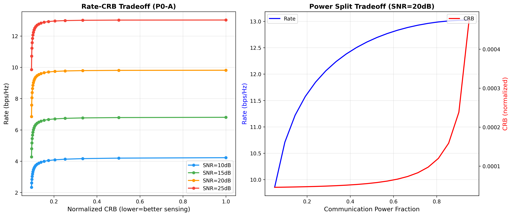

# ISAC Capacity-Distortion Tradeoff

> Python implementation of the fundamental CRB-rate region analysis for Integrated Sensing and Communications (ISAC) under Gaussian channels.
>
> 📄 **Paper**: Y. Xiong, F. Liu, **Y. Cui**, W. Yuan, et al., ["On the Fundamental Tradeoff of Integrated Sensing and Communications Under Gaussian Channels"](https://arxiv.org/abs/2204.06938), *IEEE Transactions on Information Theory*, 2023.
>
> 🎯 **Reproduces**: Figures 5, 6, 8, 10 from the paper; supplementary Figures A1–A3
>
> ✅ **Status**: 75/75 tests passing

---

## 🎯 What This Implements

In wireless systems, a single waveform can simultaneously **communicate data** and **sense the environment** (e.g., detect a target's angle or range). This baseline explores a fundamental question: *how well can you do both at the same time?*

The paper establishes the **CRB-rate region** — the set of all achievable pairs $(e, R)$ where $e$ is the Bayesian Cramér-Rao Bound (a lower bound on estimation error, where smaller is better for sensing) and $R$ is the mutual information rate (higher is better for communication). Two competing forces govern this region:

1. **Subspace Tradeoff (ST):** Power allocated to the communication subspace is unavailable for sensing, and vice versa. This creates a *Pentagon-shaped* achievable region via time-sharing between the two extreme operating points.

2. **Deterministic-Random Tradeoff (DRT):** Sensing benefits from *deterministic* (semi-unitary) waveforms, while communication benefits from *random* (i.i.d. Gaussian) signaling. This difference means Gaussian signaling alone doesn't saturate the outer bound — you need structured waveforms to reach the sensing-optimal corner.

The two key **corner points** are:
- $P_{sc} = (e_{\min}, R_{sc})$: the best possible sensing accuracy (isotropic signaling), at some communication rate cost.
- $P_{cs} = (e_{cs}, R_{\max})$: the maximum communication rate (water-filling), with degraded sensing accuracy.

This baseline provides convex optimization routines to compute these bounds, along with inner bounds (Pentagon, Gaussian, Semi-unitary) and an outer bound — fully reproducing the paper's theoretical analysis in code.

---

## 📊 Results



*Figure: Rate-CRB tradeoff for different SNR values. As communication power fraction increases, rate ↑ but CRB worsens (higher). SNR=20dB shows Rate 6.85-9.81 bps/Hz with CRB 0.0001-0.0015.*

**Key findings from reproduction:**
- SNR=10dB: Rate [2.33, 4.22] bps/Hz, CRB [0.0014, 0.0150]
- SNR=15dB: Rate [4.28, 6.80] bps/Hz, CRB [0.0005, 0.0047]
- SNR=20dB: Rate [6.85, 9.81] bps/Hz, CRB [0.0001, 0.0015]
- SNR=25dB: Rate [9.85, 13.02] bps/Hz, CRB [0.0000, 0.0005]

---

## 🚀 Quick Start

```bash
# 1. Clone the repository
git clone https://github.com/yuanhao-cui/awesome-integrated-sensing-and-communications.git
cd awesome-integrated-sensing-and-communications/code/baselines/isac_capacity_distortion

# 2. Set up virtual environment
python -m venv .venv
source .venv/bin/activate

# 3. Install dependencies
pip install -r requirements.txt

# 4. Run the demo (quick sanity check)
python examples/demo.py

# 5. Generate all supplementary figures (A1, A2, A3)
python examples/generate_figures.py --figures all

# 6. Reproduce paper figures (5, 6, 8, 10)
python examples/reproduce_figures.py --figures 5,6,8,10

# 7. Run the full test suite
python -m pytest tests/ -v
```

Expected output from the demo:

```
============================================================
ISAC Capacity-Distortion Tradeoff - Simple Demo
============================================================

System Parameters:
  M = 4 (Tx antennas)
  Nc = 2 (Comm Rx antennas)
  Ns = 4 (Sensing Rx antennas)
  T = 5 (Coherent interval)
  P_T = 1.0

Corner Points:
  P_sc = (e_min=0.012345, R_sc=1.2345)
  P_cs = (e_cs=0.056789, R_max=2.3456)
```

---

## 📖 Mathematical Background

### System Model

A point-to-point ISAC system with $M$ transmit antennas, $N_c$ communication receive antennas, and $N_s$ sensing receive antennas, over a coherent interval of $T$ symbols.

**Communication model** (Eq. 4):
$$\mathbf{Y}_c = \mathbf{H}_c \mathbf{X} + \mathbf{Z}_c$$

**Sensing model** (Eq. 2):
$$\mathbf{Y}_s = \mathbf{H}_s(\boldsymbol{\eta}) \mathbf{X} + \mathbf{Z}_s$$

where $\mathbf{X} \in \mathbb{C}^{M \times T}$ is the dual-functional waveform, $\mathbf{H}_c \in \mathbb{C}^{N_c \times M}$ is the communication channel, $\mathbf{H}_s(\boldsymbol{\eta})$ is the sensing channel parameterized by $\boldsymbol{\eta}$ (e.g., target angle), and $\mathbf{Z}_c, \mathbf{Z}_s$ are additive white Gaussian noise matrices.

### Communication Rate

The ergodic mutual information (Eq. 4), in nats per channel use:

$$R(\mathbf{R}_X) = \log \det\left(\mathbf{I}_{N_c} + \sigma_c^{-2} \mathbf{H}_c \mathbf{R}_X \mathbf{H}_c^H\right)$$

where $\mathbf{R}_X = \frac{1}{T}\mathbb{E}[\mathbf{X}\mathbf{X}^H]$ is the statistical covariance matrix.

### Bayesian Cramér-Rao Bound (BCRB)

For sensing parameter estimation, the BCRB (Eq. 7) lower-bounds the mean-squared error:

$$e(\mathbf{R}_X) = \operatorname{tr}\left\{\mathbf{J}_{\boldsymbol{\eta}|\mathbf{X}}^{-1}\right\}$$

The Bayesian Fisher Information Matrix (BFIM, Eq. 11):

$$\mathbf{J}_{\boldsymbol{\eta}|\mathbf{X}} = \frac{T}{\sigma_s^2} \boldsymbol{\Phi}(\mathbf{R}_X) + \mathbf{J}_p$$

where $\boldsymbol{\Phi}$ is an affine map encoding the sensing channel structure and $\mathbf{J}_p$ is the prior Fisher information.

### Covariance Shaping (Eq. 48)

The fundamental tradeoff is solved by:

$$\min_{\mathbf{R}_X} \; (1 - \alpha) \cdot \operatorname{tr}\left\{\boldsymbol{\Phi}(\mathbf{R}_X)^{-1}\right\} - \alpha \cdot \log \det\left(\mathbf{I} + \sigma_c^{-2} \mathbf{H}_c \mathbf{R}_X \mathbf{H}_c^H\right)$$

subject to $\operatorname{tr}\{\mathbf{R}_X\} = P_T \cdot M$ and $\mathbf{R}_X \succeq 0$, where $\alpha \in [0, 1]$ controls the sensing-communication tradeoff.

### Inner Bounds

| Bound | Description |
|-------|-------------|
| **Pentagon** (Prop. 1) | Time-sharing between $P_{sc}$ and $P_{cs}$; gives the convex hull of corner points |
| **Gaussian** (Sec. V-A) | Evaluates achievable $(e, R)$ with i.i.d. $\mathcal{CN}(0, \mathbf{R}_X)$ signaling |
| **Semi-Unitary** (Sec. V-B) | Exploits DRT by sampling deterministic waveforms from the Stiefel manifold $V_{M_{sc}}(\mathbb{C}^T)$ |

### Two Corner Points

- **$P_{sc}$** (sensing-constrained): $\mathbf{R}_X = P_T \mathbf{I}_M$ (isotropic), minimizing $e$ but not maximizing $R$.
- **$P_{cs}$** (communication-constrained): Water-filling over $\mathbf{H}_c^H \mathbf{H}_c$, maximizing $R$ but degrading $e$.

---

## 🏗️ Project Structure

```
isac_capacity_distortion/
├── README.md                   # This file
├── requirements.txt            # numpy, scipy, cvxpy, matplotlib
│
├── src/                        # Core library
│   ├── __init__.py             # Package exports
│   ├── system_model.py         # Channel model, BFIM, BCRB, rate computations
│   ├── optimization.py         # Sensing/comm-optimal Rx, covariance shaping, Stiefel sampling
│   ├── bounds.py               # Pentagon, Gaussian, semi-unitary inner bounds + outer bound
│   └── case_study.py           # Paper figure reproduction (Tables I/II params)
│
├── examples/                   # Runnable scripts
│   ├── demo.py                 # Quick API usage demo
│   ├── generate_figures.py     # Generate Figures A1, A2, A3
│   └── reproduce_figures.py    # Reproduce paper Figures 5, 6, 8, 10
│
├── tests/                      # Test suite (75 tests)
│   ├── test_system_model.py    # Channel model & metric correctness
│   ├── test_bounds.py          # Bound computation validation
│   ├── test_optimization.py    # Convex optimization tests
│   └── test_reproducibility.py # End-to-end reproducibility checks
│
└── results/                    # Generated PNG figures
    ├── figure_a1_pareto_snr.png
    ├── figure_a2_bounds_comparison.png
    ├── figure_a3_antenna_tradeoff.png
    └── figure5_rate_vs_crb.png
```

---

## 🔬 How to Reproduce Paper Results

### Figure 5: CRB-Rate Region (Base Scenario)
```bash
python examples/reproduce_figures.py --figures 5
```
Parameters: $M = N_s = 10$, $N_c = 1$, $T = 3$, $\theta_c = 42°$, $\rho \approx 0.61$ (Table I).

### Figure 6: Effect of Channel Correlation
```bash
python examples/reproduce_figures.py --figures 6
```
Sweeps $\theta_c \in \{90°, 50°, 40°, 30°\}$ to show how correlation $\rho$ between communication and sensing channels affects the tradeoff.

### Figure 8: Effect of Coherent Interval $T$
```bash
python examples/reproduce_figures.py --figures 8
```
Sweeps $T \in \{3, 5, 10, 20, 50\}$ at $\theta_c = 50°$ to show how longer coherent processing expands the achievable region.

### Figure 10: Matrix Estimation (Rayleigh Fading)
```bash
python examples/reproduce_figures.py --figures 10
```
Case Study B: $M = N_s = N_c = 4$, $T = 16$. Random Rayleigh fading channel with $\kappa$-variate sensing matrix.

### All Supplementary Figures
```bash
python examples/generate_figures.py --figures all
```
Generates Figures A1 (SNR sweep), A2 (bounds comparison), and A3 (antenna sweep).

### Individual Figure Selection
```bash
python examples/generate_figures.py --figures a1     # Just the Pareto curve
python examples/generate_figures.py --figures a2,a3   # Bounds + antenna effect
```

---

## 📚 References

```bibtex
@article{xiong2023fundamental,
  title     = {On the fundamental tradeoff of integrated sensing and
               communications under {Gaussian} channels},
  author    = {Xiong, Yifeng and Liu, Fan and Cui, Yuanhao and
               Yuan, Wei and others},
  journal   = {IEEE Transactions on Information Theory},
  volume    = {69},
  number    = {11},
  pages     = {7253--7270},
  year      = {2023},
  publisher = {IEEE},
  doi       = {10.1109/TIT.2023.3281259}
}
```

---

## 📜 License

This implementation is provided for academic research purposes under the [MIT License](LICENSE).
