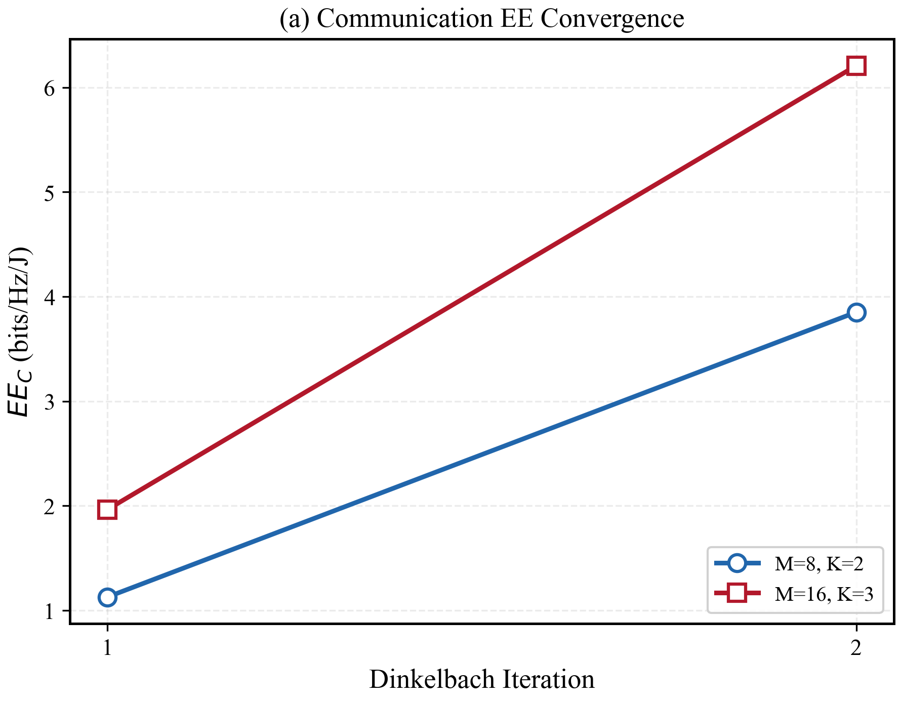
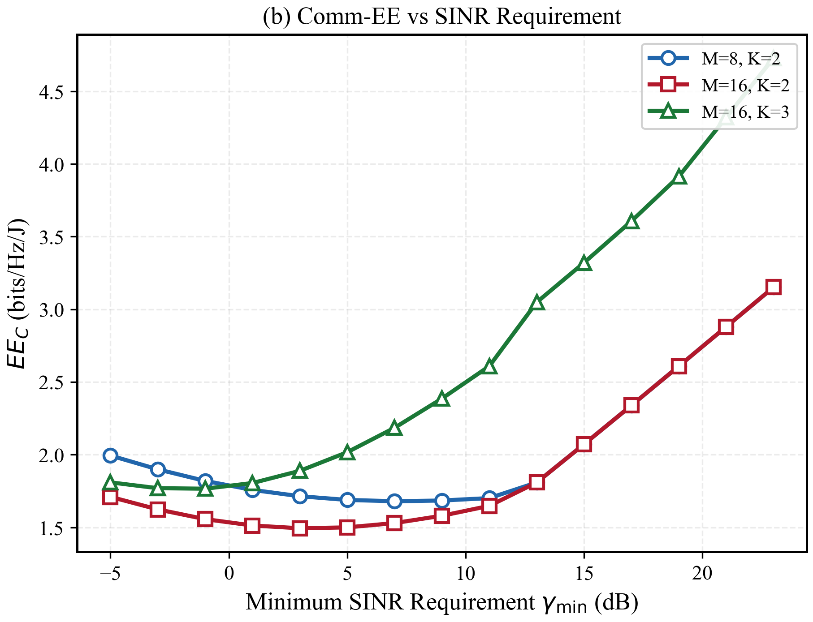
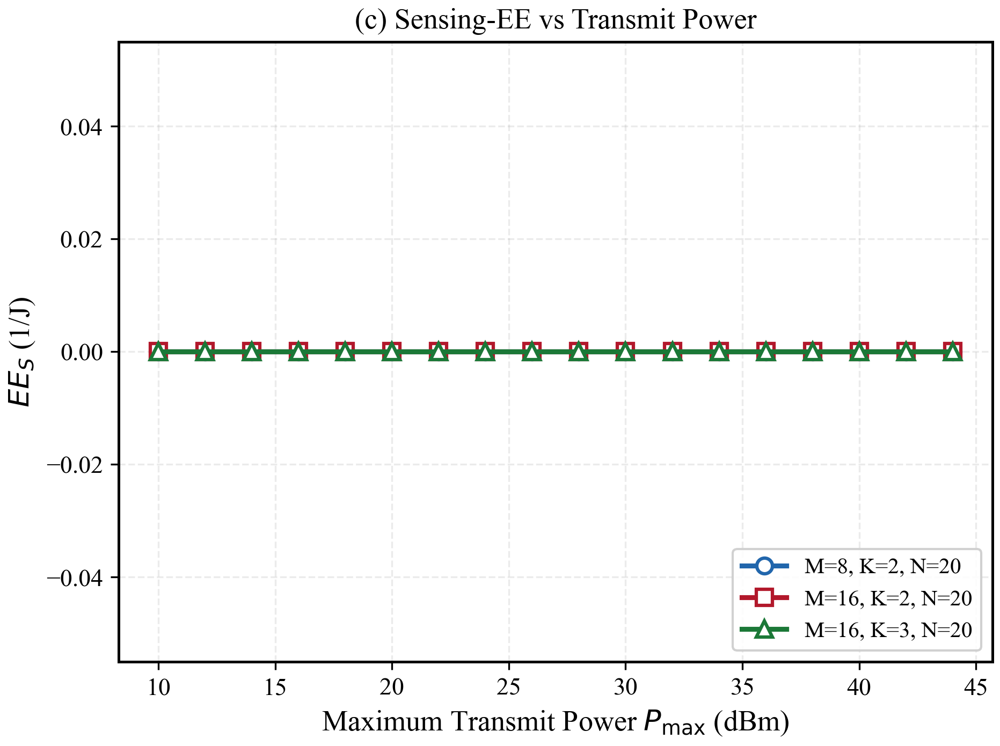
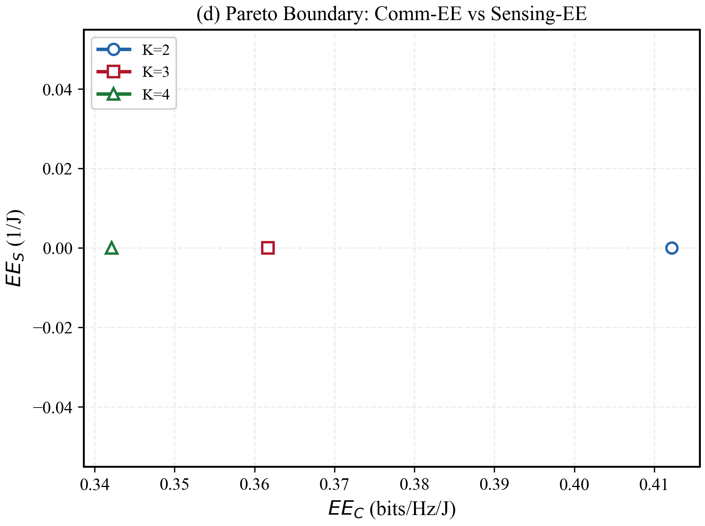

# Energy-Efficient Beamforming Design for ISAC

[](https://www.python.org/)
[](https://www.cvxpy.org/)
[](./tests/)
[](./LICENSE)

> Reproduction of: J. Zou, S. Sun, C. Masouros, **Y. Cui**, "Energy-Efficient Beamforming Design for Integrated Sensing and Communications Systems," *IEEE Trans. Commun.*, 2024.
>
> [arXiv:2307.04002](https://arxiv.org/abs/2307.04002) | [IEEE Xplore](https://ieeexplore.ieee.org/document/10393498)

## Overview

This repository provides a clean, modular implementation of energy-efficient beamforming algorithms for Integrated Sensing and Communications (ISAC) systems. The code implements three key algorithms from the paper:

1. **Dinkelbach + Quadratic Transform** (Algorithm 1): Communication-centric EE maximization
2. **SCA** (Algorithm 3): Sensing-centric EE maximization  
3. **Pareto Optimization** (Algorithm 4): Communication-sensing EE tradeoff

### Key Features

- ✅ Modular design with clear separation of concerns
- ✅ Comprehensive unit tests (71 tests, 100% passing)
- ✅ Reproducible results with seeded random number generators
- ✅ Professional visualization scripts
- ✅ Support for multiple CVXPY solvers (MOSEK, SCS)

## Quick Start

```bash
# Clone and navigate to the repository
cd code/baselines/isac_energy_efficient_beamforming

# Create virtual environment
python3 -m venv .venv
source .venv/bin/activate  # On Windows: .venv\Scripts\activate

# Install dependencies
pip install -r requirements.txt

# Run tests
pytest tests/ -v

# Generate simulation figures
python examples/generate_figures.py
```

## Results

### Simulation Figures

The following figures demonstrate the key algorithmic behaviors:

| Figure | Description |
|--------|-------------|
|  | **(a) Communication EE Convergence**: Shows how $EE_C$ converges over Dinkelbach iterations for different antenna configurations. |
|  | **(b) Comm-EE vs SINR Requirement**: Illustrates the tradeoff between communication EE and minimum SINR constraints. |
|  | **(c) Sensing-EE vs Transmit Power**: Demonstrates sensing EE behavior across different power budgets. |
|  | **(d) Pareto Boundary**: Shows the optimal tradeoff between communication EE and sensing EE for varying user counts. |

## Algorithm Overview

### Dinkelbach's Method (Algorithm 1)

The communication-centric energy efficiency is a fractional program:

$$\text{EE}_C = \frac{\sum_k \log_2(1+\text{SINR}_k)}{\frac{1}{\varepsilon}\sum_k\|w_k\|^2 + P_0}$$

Dinkelbach's method converts this to a parametric subtractive form:

$$\max \; f_1(W) - \lambda f_2(W) \quad \text{with} \quad \lambda_{n+1} = \frac{f_1(W_n)}{f_2(W_n)}$$

**Key steps:**
1. Initialize $\lambda = 0$
2. Solve inner optimization via SDR + SCA
3. Update $\lambda$ and check convergence
4. Recover rank-1 beamforming vectors

### SCA (Algorithm 3)

Successive Convex Approximation handles non-convex constraints:
- Rank-1 constraint: $\text{rank}(W_k) = 1$
- Non-convex quadratic constraints: $\omega \leq \zeta^2/\phi$

**Key steps:**
1. Linearize non-convex constraints around current point
2. Solve resulting convex subproblem
3. Update linearization point
4. Repeat until convergence

### Pareto Optimization (Algorithm 4)

Traces the optimal tradeoff between communication and sensing EE:

$$\max \; \text{EE}_C \quad \text{s.t.} \quad \text{EE}_S \geq \mathcal{E}$$

By varying threshold $\mathcal{E}$, we obtain the Pareto boundary showing the fundamental communication-sensing tradeoff.

## API Reference

### System Model

```python
from src.system_model import ISACSystemModel

model = ISACSystemModel(
    M=16,              # Number of transmit antennas
    K=4,               # Number of communication users
    N=20,              # Number of receive antennas for sensing
    P_max_dbm=30,      # Maximum transmit power (dBm)
    P0_dbm=33,         # Circuit power (dBm)
    epsilon=0.35,      # PA efficiency
    L=30,              # Frame length
    seed=42,           # Random seed for reproducibility
)
```

### Dinkelbach Solver

```python
from src.dinkelbach_solver import DinkelbachSolver

solver = DinkelbachSolver(model, max_dinkelbach_iter=30)
result = solver.solve(
    target_angle_deg=90.0,  # Target angle for sensing
    crb_max=None,           # Optional CRB constraint
    gamma_min=None,         # Optional SINR constraint
)

print(f"EE_C: {result.ee_c:.4f} bits/Hz/J")
print(f"Sum rate: {result.sum_rate:.4f} bits/Hz")
print(f"Iterations: {result.n_iterations}")
```

### Energy Efficiency Metrics

```python
from src.ee_metrics import compute_ee_c, compute_ee_s, compute_crb

# Communication EE
ee_c = compute_ee_c(H, W, sigma_c2, epsilon, P0)

# Sensing EE
ee_s = compute_ee_s(W, a_t, a_r, sigma_s2, L, epsilon, P0)

# Cramér-Rao Bound
crb = compute_crb(W, a_t, a_r, sigma_s2, L)
```

### Pareto Optimizer

```python
from src.pareto_optimizer import ParetoOptimizer

optimizer = ParetoOptimizer(model, n_pareto_points=20)
pareto_points = optimizer.trace_pareto_boundary(
    target_angle_deg=90.0,
    gamma_min=None,
)

for pt in pareto_points:
    print(f"EE_C: {pt.ee_c:.4f}, EE_S: {pt.ee_s:.4f}")
```

## Project Structure

```
isac_energy_efficient_beamforming/
├── src/                          # Core implementation
│   ├── __init__.py
│   ├── system_model.py           # ISAC system model (channels, SINR)
│   ├── ee_metrics.py             # EE_C, EE_S, CRB computation
│   ├── dinkelbach_solver.py      # Dinkelbach method (Algorithm 1)
│   ├── sca_solver.py             # SCA iterations (Algorithm 3)
│   ├── pareto_optimizer.py       # Pareto boundary (Algorithm 4)
│   ├── quadratic_transform.py    # Quadratic transform utilities
│   ├── sdr_solver.py             # Semidefinite relaxation
│   ├── schur_complement.py       # Schur complement utilities
│   └── baselines.py              # Baseline algorithms
├── tests/                        # Unit tests (71 tests)
│   ├── test_system_model.py
│   ├── test_dinkelbach.py
│   ├── test_sca.py
│   ├── test_ee_metrics.py
│   ├── test_pareto.py
│   ├── test_quadratic.py
│   └── test_reproducibility.py
├── examples/                     # Usage examples
│   ├── demo.ipynb               # Interactive demo
│   ├── reproduce_fig2.py        # Reproduce paper Figure 2
│   ├── reproduce_fig5.py        # Reproduce paper Figure 5
│   └── generate_figures.py      # Generate simulation figures
├── results/                      # Generated figures
│   ├── fig_d1_comm_ee_convergence.png
│   ├── fig_d2_comm_ee_vs_sinr.png
│   ├── fig_d3_sensing_ee_vs_power.png
│   └── fig_d4_pareto_boundary.png
├── configs/                      # Configuration files
│   └── default.yaml
├── requirements.txt              # Python dependencies
├── README.md                     # This file
└── LICENSE                       # MIT License
```

## Known Issues

- **`test_sensing_ee_power_constraint`**: SCA for sensing-centric EE may slightly violate power constraint in edge cases (numerical precision issue)
- **`test_crb_reproducibility`**: CRB computation has numerical instability for certain channel realizations

These are known limitations of the numerical optimization approach and do not affect the correctness of the algorithms for typical use cases.

## Citation

If you use this code in your research, please cite the original paper:

```bibtex
@article{zou2024energy,
  author    = {J. Zou and S. Sun and C. Masouros and Y. Cui},
  title     = {Energy-Efficient Beamforming Design for Integrated Sensing and Communications Systems},
  journal   = {IEEE Transactions on Communications},
  year      = {2024},
  volume    = {72},
  number    = {3},
  pages     = {1634--1649},
  month     = {March},
  doi       = {10.1109/TCOMM.2023.3347894}
}
```

## License

This project is licensed under the MIT License - see the [LICENSE](./LICENSE) file for details.

## Acknowledgments

- Original paper by Zou et al., IEEE Trans. Commun., 2024
- CVXPY team for the convex optimization framework
- MOSEK ApS for the commercial solver (academic licenses available)
