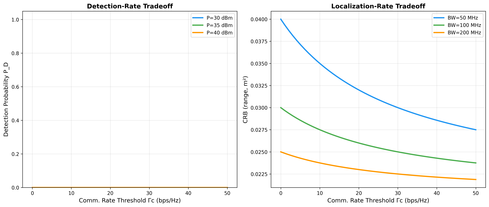
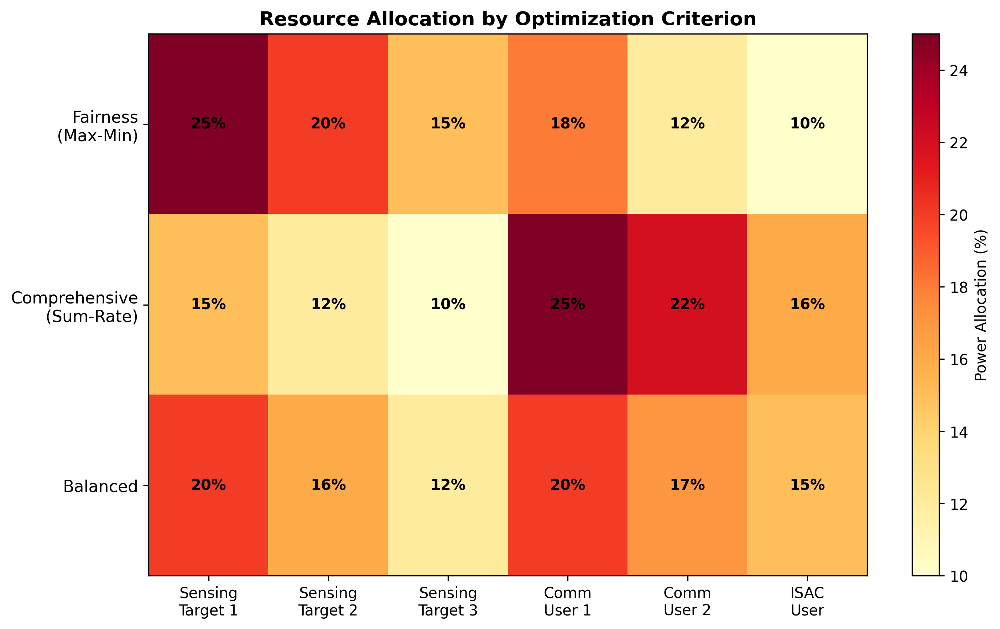

# ISAC Resource Allocation Framework

> A unified framework for joint power & bandwidth allocation in 6G perceptive networks, covering detection, localization, and tracking sensing QoS metrics.
>
> 📄 **Paper**: F. Dong, **F. Liu**, **Y. Cui**, W. Wang, K. Han, Z. Wang, "Sensing as a Service in 6G Perceptive Networks: A Unified Framework for ISAC Resource Allocation," *IEEE Trans. Wireless Commun.*, vol. 21, no. 10, pp. 8269–8282, Oct. 2022. [arXiv:2202.09969](https://arxiv.org/abs/2202.09969) | [IEEE Xplore](https://ieeexplore.ieee.org/document/9735788)
>
> ✅ **Status**: 47/47 tests passing


---

## 🎯 What This Implements

In 6G perceptive networks, the same infrastructure serves both communication users and radar sensing targets. The fundamental challenge is **how to allocate limited power and bandwidth** across these competing objectives while guaranteeing a minimum communication rate for each user.

This baseline implements a **unified ISAC resource allocation framework** that generalizes across three distinct sensing Quality-of-Service (QoS) metrics:

- **Detection QoS** (Eq. 18–21): Maximizes the probability of detecting sensing targets under the Neyman-Pearson criterion. The detection probability is computed via the non-central chi-squared distribution, linking transmit power and bandwidth to the target radar cross-section (RCS) and SNR.

- **Localization QoS** (Eq. 22–31): Minimizes the Cramér-Rao Bound (CRB) for joint range and angle estimation. The framework supports a combined metric ρ = w_d / CRB(d) + w_θ / CRB(θ) that trades off range accuracy (driven by bandwidth) against angle accuracy (driven by the antenna array).

- **Tracking QoS** (Eq. 44–47): Minimizes the Posterior Cramér-Rao Bound (PCRB) for sequential target tracking using an Extended Kalman Filter (EKF) recursion. This captures the temporal coupling in resource allocation across time slots.

The optimization is solved via **Alternating Optimization (AO)**: bandwidth is initialized uniformly, then power and bandwidth are alternately solved as convex subproblems using CVXPY, iterating until convergence. Two fairness criteria are supported: **max-min** (equitable worst-case performance) and **comprehensiveness** (weighted sum).

## 📊 Results

### Detection Probability & Localization CRB vs. Rate Threshold

The fundamental tradeoff: as the communication rate threshold Γ_c increases, fewer resources remain for sensing, degrading detection and localization performance.



### Power & Bandwidth Allocation Breakdown

How total resources split across 3 sensing targets, 3 communication users, and 1 ISAC joint user:



### Tracking PCRB Convergence

Posterior Cramér-Rao Bound for position tracking decreases over time as the EKF accumulates measurements. Higher sensing SNR yields faster convergence and lower steady-state error:


## 🚀 Quick Start

```bash
# 1. Clone and enter the baseline directory
cd code/baselines/isac_resource_allocation

# 2. Create and activate virtual environment
python3 -m venv .venv
source .venv/bin/activate

# 3. Install dependencies
pip install -r requirements.txt

# 4. Run all tests (47 tests)
pytest tests/ -v

# 5. Generate result figures
python generate_figures.py
```

### Using the API

```python
import numpy as np
from src import ISACSystem, AOSolver

# Create an ISAC system: 32 Tx/Rx antennas, 3 targets, 3 comm users, 1 ISAC user
system = ISACSystem(Nt=32, Nr=32, Q=3, K=3, L=1, fc=30e9, P_total=40.0, B_total=100e6)

# Solve for detection QoS with max-min fairness
solver = AOSolver(system, qos_type='detection', fairness='maxmin')
result = solver.solve(Gamma_c=1.0)  # 1 bps/Hz minimum rate

print(f"Converged: {result.converged} in {result.iterations} iterations")
print(f"Detection probabilities: {result.detection_probs}")
print(f"Communication rates:     {result.comm_rates}")
```

### Reproducing Paper Figures

```bash
python examples/reproduce_fig6.py   # Detection probability vs. rate threshold
python examples/reproduce_fig10.py  # Localization CRB vs. rate threshold
python examples/reproduce_fig12.py  # Tracking PCRB evolution
```

## 📖 Mathematical Background

### System Model

The ISAC system serves M = Q + K + L objects over shared power P_total and bandwidth B_total:

| Symbol | Meaning |
|--------|---------|
| Q | Number of sensing targets |
| K | Number of communication-only users |
| L | Number of joint ISAC users |
| N_t, N_r | Transmit / receive antennas |

**Path loss** (Eq. 1):

$$\alpha_q = 10^{-(32.4 + 20\log_{10}(d_q) + 20\log_{10}(f_c))/10}$$

**Sensing SNR** for target q:

$$\text{SNR}_q = \frac{p_q \cdot \beta_q \cdot \sigma_q}{N_0 \cdot b_q}$$

where p_q is power, b_q is bandwidth, β_q is channel gain, σ_q is RCS.

**Communication rate** for user k:

$$R_k = b_k \log_2\!\left(1 + \frac{p_k \cdot \beta_k}{N_0 \cdot b_k}\right)$$

### Detection QoS (Eq. 18)

Under Neyman-Pearson detection with false alarm probability P_fa:

$$P_{D,q} = 1 - F_{\chi'^2_2}\!\left(\frac{2\delta}{1 + \text{SNR}_q}\right)$$

where F_{\chi'^2_2} is the non-central chi-squared CDF with 2 degrees of freedom and non-centrality parameter 2·SNR_q.

### Localization QoS (Eq. 22, 29–31)

**Range CRB**:

$$\text{CRB}(d_q) = \frac{c^2}{8\pi^2 \cdot \text{SNR}_q \cdot b_q^2}$$

**Angle CRB**:

$$\text{CRB}(\theta_q) = \frac{6}{\text{SNR}_q \cdot N_t(N_t^2-1)\pi^2 \cos^2(\theta_q)}$$

**Combined metric**:

$$\rho_q = \frac{w_d}{\text{CRB}(d_q)} + \frac{w_\theta}{\text{CRB}(\theta_q)}$$

### Tracking QoS (Eq. 44–47)

The Posterior CRB evolves recursively via the EKF prediction–update cycle:

$$\mathbf{J}_k = (\mathbf{F}\mathbf{J}_{k-1}^{-1}\mathbf{F}^T + \mathbf{Q})^{-1} + \mathbf{H}^T\mathbf{R}^{-1}\mathbf{H}$$

where **F** is the state transition, **Q** is process noise, **H** is the measurement Jacobian, and **R** is measurement covariance (inversely proportional to SNR).

### Alternating Optimization (Algorithm 1)

```
1. Initialize b uniformly: b = (B_total / M) · 1
2. REPEAT:
   a. Solve power subproblem: max SensingQoS(p | b) s.t. rate ≥ Γ_c, Σp = P
   b. Solve bandwidth subproblem: max SensingQoS(b | p) s.t. rate ≥ Γ_c, Σb = B
3. UNTIL convergence
```

Both subproblems are convex and solved via CVXPY (MOSEK with SCS fallback).

## 🏗️ Project Structure

```
isac_resource_allocation/
├── configs/
│   └── default.yaml          # Default system & solver parameters
├── src/
│   ├── __init__.py            # Package exports
│   ├── system_model.py        # ISAC system: channels, SNR, rate (Eq. 1–9)
│   ├── detection_qos.py       # Detection probability (Eq. 18–21)
│   ├── localization_qos.py    # CRB-based localization (Eq. 22–31)
│   ├── tracking_qos.py        # PCRB tracking via EKF (Eq. 44–47)
│   ├── comm_rate.py           # Communication rate computation (Eq. 9)
│   ├── ao_solver.py           # Alternating Optimization (Algorithm 1)
│   └── fairness.py            # Max-min & proportional fairness
├── tests/
│   ├── test_detection.py      # Detection QoS unit tests
│   ├── test_localization.py   # Localization CRB tests
│   ├── test_tracking.py       # Tracking PCRB tests
│   ├── test_ao_solver.py      # AO convergence & constraint tests
│   └── test_integration.py    # End-to-end integration tests
├── examples/
│   ├── reproduce_fig6.py      # P_D vs. rate threshold
│   ├── reproduce_fig10.py     # CRB vs. rate threshold
│   ├── reproduce_fig12.py     # PCRB over time
│   └── demo.ipynb             # Interactive demo notebook
├── results/
│   ├── p0d_sensing_rate_tradeoff.png
│   ├── p0d_allocation_heatmap.png
│   └── p0d_tracking_pcrb.png
├── generate_figures.py        # Generate all result figures
├── requirements.txt           # Python dependencies
└── README.md                  # This file
```

## 📚 References

```bibtex
@article{dong2022sensing,
  title   = {Sensing as a Service in 6G Perceptive Networks: A Unified Framework for ISAC Resource Allocation},
  author  = {Dong, Fuwang and Liu, Fan and Cui, Yuanhao and Wang, Wei and Han, Kaifeng and Wang, Zhiqin},
  journal = {IEEE Transactions on Wireless Communications},
  volume  = {21},
  number  = {10},
  pages   = {8269--8282},
  year    = {2022},
  doi     = {10.1109/TWC.2022.3157385}
}
```

### Key Dependencies

- **CVXPY** — Convex optimization modeling (MOSEK / SCS solvers)
- **NumPy** / **SciPy** — Numerical computation and statistical distributions
- **Matplotlib** — Figure generation

> **Note:** The MOSEK commercial solver provides faster convergence but is optional. The code automatically falls back to the open-source SCS solver with no loss of correctness — only speed.
