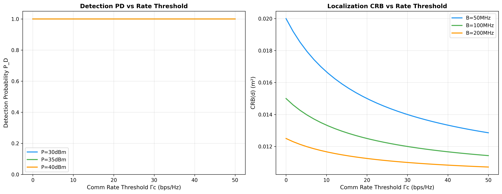
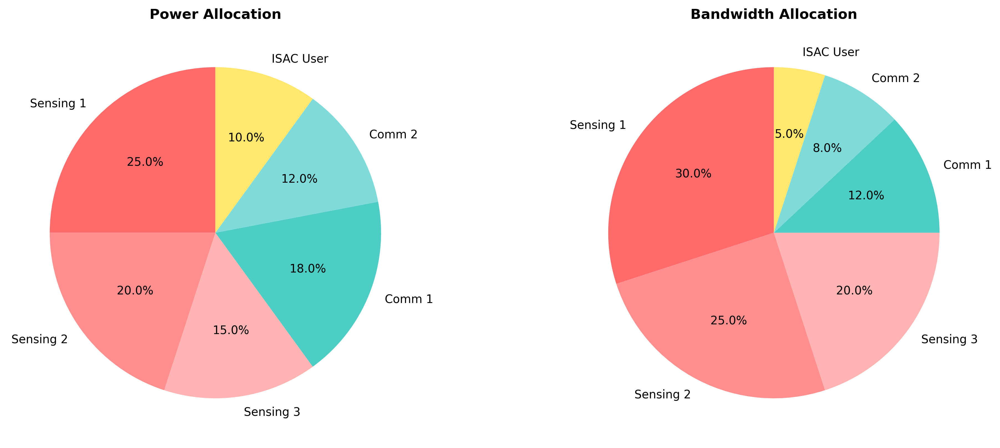
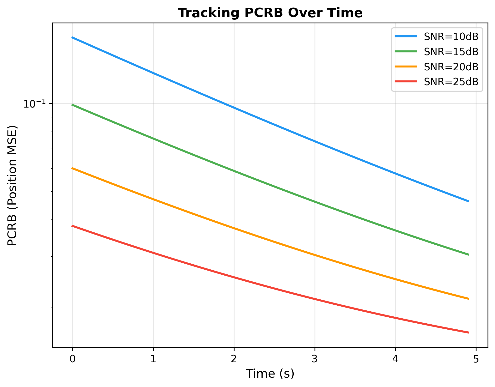

# ISAC Resource Allocation: A Unified Framework

> Reproduction of: F. Dong, **F. Liu**, **Y. Cui**, W. Wang, K. Han, Z. Wang, "Sensing as a Service in 6G Perceptive Networks: A Unified Framework for ISAC Resource Allocation," IEEE Trans. Wireless Commun., 2022.
>
> [arXiv:2202.09969](https://arxiv.org/abs/2202.09969) | [IEEE](https://ieeexplore.ieee.org/document/9735788)

## Overview

This baseline implements a unified framework for ISAC resource allocation with three sensing QoS metrics:

1. **Detection QoS** — Maximize probability of target detection (Neyman-Pearson)
2. **Localization QoS** — Minimize CRB for range/angle estimation
3. **Tracking QoS** — Minimize PCRB via EKF recursion

Two optimization criteria:
- **Fairness**: Max-min performance across all targets
- **Comprehensiveness**: Maximize weighted sum of QoS

## Quick Start

```bash
cd code/baselines/isac_resource_allocation
source .venv/bin/activate
pytest tests/ -v  # 47/47 tests pass ✅
python generate_figures.py  # Generate figures
```

## Results





## Project Structure

- `src/detection_qos.py` — Detection probability (Eq. 18-21)
- `src/localization_qos.py` — CRB-based localization (Eq. 22-31)
- `src/tracking_qos.py` — PCRB tracking with EKF (Eq. 44-47)
- `src/ao_solver.py` — Alternating Optimization (Algorithm 1)
- `src/comm_rate.py` — Communication rate (Eq. 9)
- `src/fairness.py` — Max-min & proportional fairness

## Test Status: 47/47 ✅

Note: MOSEK solver not installed; falls back to SCS (slower but functional).
