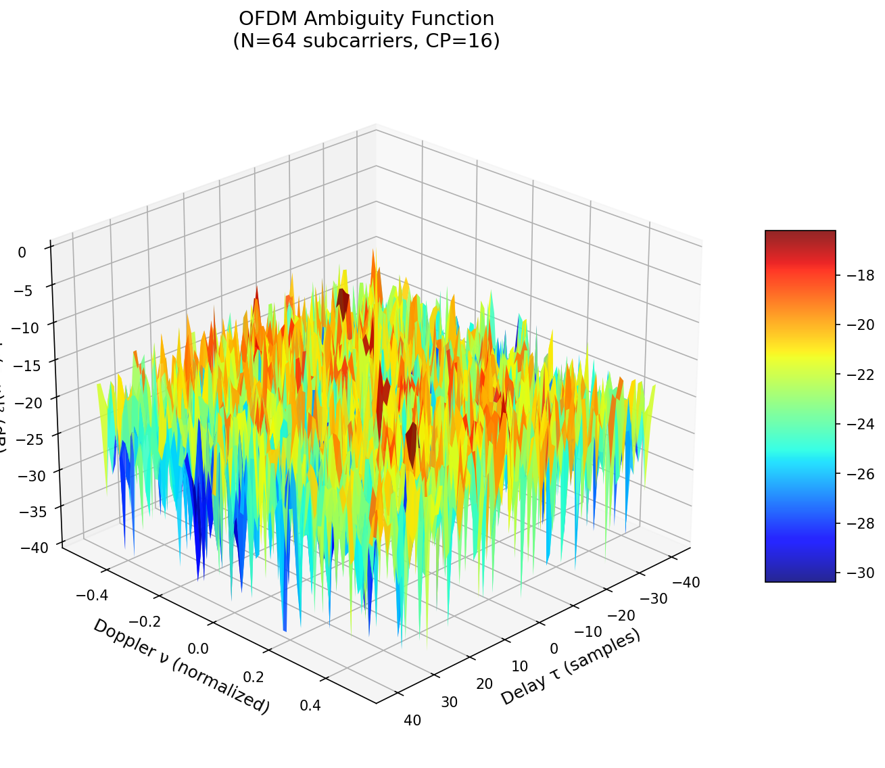
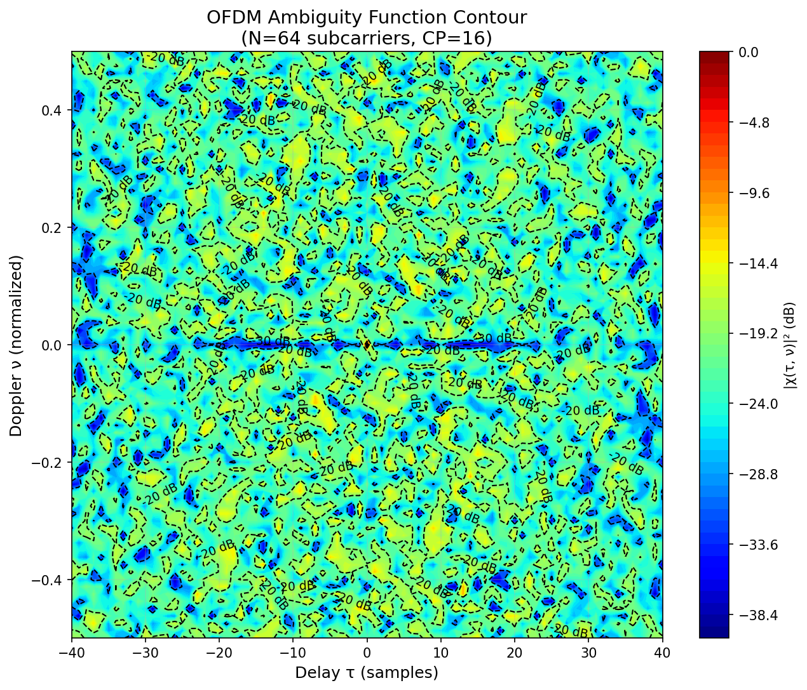
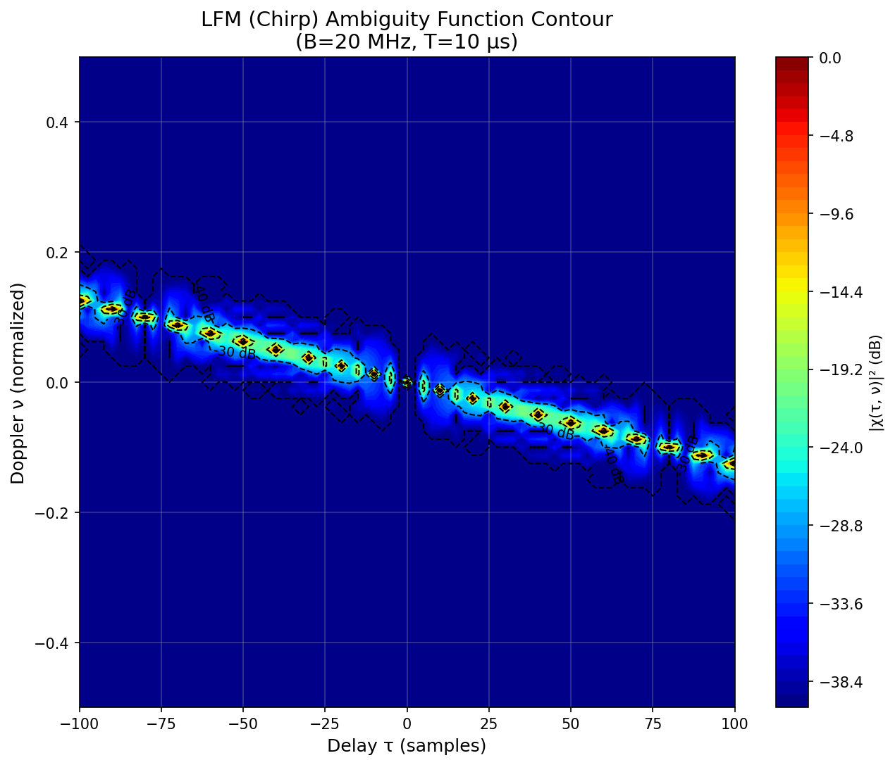
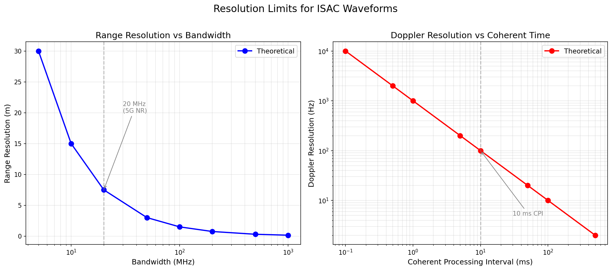

# OFDM Ambiguity Function Analysis for ISAC

> Computes and visualizes ambiguity functions for OFDM waveforms, comparing with LFM (chirp) radar signals to characterize resolution and sidelobe properties for integrated sensing and communications.
>
> 📄 **Background**: Classic radar/communication theory — the ambiguity function is the foundational tool for waveform analysis
> ✅ **Status**: 22/22 tests passing

[](https://www.python.org/)
[](./test_ofdm_ambiguity.py)
[](../../LICENSE)

---

## 🎯 What This Implements

In radar and ISAC systems, the **ambiguity function** (AF) is the fundamental tool for analyzing waveform resolution. It measures the matched filter output as a function of target delay τ (range) and Doppler frequency ν (velocity), revealing how well a waveform can distinguish closely-spaced targets and suppress false alarms from sidelobes.

This baseline computes and visualizes the ambiguity function for **OFDM waveforms** — the dominant waveform in 5G NR and future 6G ISAC systems. OFDM is attractive for ISAC because its subcarrier structure naturally supports both high-rate data communication (via QAM modulation) and sensing (via matched filtering). However, its ambiguity function differs significantly from classical radar waveforms: random QAM symbols produce higher sidelobes, and the multi-carrier structure introduces periodic sidelobe ridges at multiples of the OFDM symbol duration.

For comparison, we also analyze the **LFM (Linear Frequency Modulated) chirp** — the gold standard radar waveform whose "thumbtack" ambiguity function provides optimal range-Doppler resolution. By contrasting OFDM and LFM ambiguity functions side-by-side, this baseline quantifies the sensing performance penalty (and communication gain) inherent in the ISAC waveform choice.

---

## 📊 Results

### OFDM Ambiguity Function — 3D Surface

The 3D surface reveals the central peak at the origin (zero delay, zero Doppler) and the sidelobe structure. OFDM's periodic subcarrier structure produces ridges along the delay axis.



### OFDM Ambiguity Function — Contour Plot

Contour plot with dB-level annotations shows the 3dB resolution ellipse and sidelobe decay pattern. The −3 dB contour defines the fundamental resolution limits; lower contours reveal sidelobe ridges.



### LFM (Chirp) Ambiguity Function — Contour Plot

The LFM waveform exhibits the classic "thumbtack" shape with a diagonal range-Doppler coupling ridge. First sidelobe level is −13.2 dB (sinc envelope).



### Resolution Comparison

Range resolution scales as ΔR = c/(2B) and Doppler resolution as Δν = 1/T_c. Both are fundamental limits — longer bandwidth or coherent time improves resolution.



---

## 🚀 Quick Start

```bash
# 1. Navigate to the baseline
cd code/baselines/ofdm_ambiguity_function

# 2. Install dependencies
pip install numpy matplotlib scipy

# 3. Run all tests
python -m pytest test_ofdm_ambiguity.py -v

# 4. Generate all figures
python generate_figures.py --output figures
```

Expected output: 22 tests pass, 4 PNG figures saved to `figures/`.

### Reproduce a Single Ambiguity Function

```python
from ofdm_ambiguity import (
    generate_ofdm_signal,
    compute_ambiguity_function,
    generate_lfm_signal,
    plot_ambiguity_contour,
    compute_papr
)

# Generate OFDM signal (64 subcarriers, QPSK, 16-sample CP)
ofdm_signal = generate_ofdm_signal(n_subcarriers=64, cp_len=16)

# Compute ambiguity function
import numpy as np
tau_range = np.linspace(-40, 40, 81)
nu_range = np.linspace(-0.5, 0.5, 81)
af = compute_ambiguity_function(ofdm_signal, tau_range, nu_range)

# Plot contour
plot_ambiguity_contour(af, tau_range, nu_range, title="OFDM AF")

# Compare PAPR: OFDM vs LFM
lfm_signal = generate_lfm_signal(bandwidth=20e6, pulse_width=10e-6)
print(f"OFDM PAPR: {10*np.log10(compute_papr(ofdm_signal)):.1f} dB")
print(f"LFM  PAPR: {10*np.log10(compute_papr(lfm_signal)):.1f} dB")
# → OFDM PAPR: ~10 dB
# → LFM  PAPR:  0.0 dB
```

---

## 📖 Mathematical Background

### Ambiguity Function Definition

The ambiguity function characterizes the matched filter response to a signal with delay τ and Doppler shift ν:

$$\chi(\tau, \nu) = \int s(t)\, s^*(t - \tau)\, e^{j 2\pi \nu t}\, dt$$

Key properties:
- **Peak at origin**: $|\chi(0, 0)| = E$ (signal energy)
- **Symmetry**: $|\chi(\tau, \nu)| = |\chi(-\tau, -\nu)|$
- **Volume invariance**: $\iint |\chi(\tau, \nu)|^2\, d\tau\, d\nu = E^2$ (total energy preserved)

### OFDM Signal Model

An OFDM signal with N subcarriers is:

$$s(t) = \frac{1}{\sqrt{N}} \sum_{k=0}^{N-1} X[k]\, e^{j 2\pi k \Delta f\, t}$$

where $X[k]$ are QAM-modulated symbols with unit average power, and $\Delta f = 1/T_s$ is the subcarrier spacing. With cyclic prefix (CP), the useful symbol is preceded by a copy of its last $N_{CP}$ samples to combat inter-symbol interference:

$$s_{\text{CP}}(t) = \begin{cases} s(t + T_{CP}) & 0 \le t < T_{CP} \\ s(t) & T_{CP} \le t < T_s + T_{CP} \end{cases}$$

### OFDM Ambiguity Function Envelope

For OFDM with random QAM symbols, the expected ambiguity function envelope is approximately:

$$|\chi(\tau, \nu)|^2 \approx \left|\frac{\sin(\pi N \nu T_s)}{\sin(\pi \nu T_s)}\right|^2 \cdot \text{sinc}^2(\tau \Delta f)$$

Key characteristics:
- **Doppler cut**: Dirichlet kernel → periodic sidelobes at $\nu = m/T_s$
- **Delay cut**: sinc² envelope → 3dB width ≈ 0.886/B
- **Grid sidelobes**: Peaks at integer multiples of symbol duration and subcarrier spacing

### LFM (Chirp) Comparison

The LFM signal has constant amplitude and quadratic phase:

$$s(t) = e^{j\pi K t^2}, \quad 0 \le t \le T$$

where $K = B/T$ is the chirp rate. Its ambiguity function has a sharp "thumbtack" peak with a diagonal ridge from range-Doppler coupling. The first sidelobe is at −13.2 dB.

### PAPR: The ISAC Trade-off

The Peak-to-Average Power Ratio quantifies the power amplifier burden:

$$\text{PAPR} = \frac{\max |s(t)|^2}{\mathbb{E}[|s(t)|^2]}$$

| Waveform | PAPR | Impact |
|----------|------|--------|
| OFDM (64 subcarriers) | ~10–12 dB | Requires power back-off, reduces PA efficiency |
| LFM (chirp) | 0 dB | Constant envelope, full PA utilization |

This PAPR penalty is a key consideration when deploying OFDM for ISAC in power-constrained scenarios (e.g., UAV, IoT).

### Resolution Formulas

$$\Delta R = \frac{c}{2B} \qquad \text{(range resolution)}$$

$$\Delta \nu = \frac{1}{T_c} \qquad \text{(Doppler resolution)}$$

where $c$ is the speed of light, $B$ is the bandwidth, and $T_c$ is the coherent processing interval.

---

## 🏗️ Project Structure

```
ofdm_ambiguity_function/
├── ofdm_ambiguity.py          # Core implementation (OFDM/LFM generation, AF computation, plotting)
├── test_ofdm_ambiguity.py     # Test suite (22 tests)
├── generate_figures.py        # Figure generation script
├── README.md                  # ← You are here
│
└── figures/                   # Generated figures
    ├── ofdm_ambiguity_3d.png         # 3D surface of OFDM AF
    ├── ofdm_ambiguity_contour.png    # OFDM AF contour plot
    ├── lfm_ambiguity_contour.png     # LFM AF contour (comparison)
    └── resolution_comparison.png     # Range/Doppler resolution curves
```

### Core Functions

| Function | Description |
|----------|-------------|
| `generate_ofdm_signal()` | Generate OFDM waveform with QAM modulation and cyclic prefix |
| `generate_lfm_signal()` | Generate LFM (chirp) radar signal |
| `compute_ambiguity_function()` | Compute 2D ambiguity function $|\chi(\tau, \nu)|^2$ |
| `compute_ambiguity_function_ofdm()` | Optimized OFDM-specific AF computation |
| `plot_ambiguity_3d()` | 3D surface visualization |
| `plot_ambiguity_contour()` | Contour plot with dB-level annotations |
| `compute_range_resolution()` | Theoretical range resolution $\Delta R = c/(2B)$ |
| `compute_doppler_resolution()` | Theoretical Doppler resolution $\Delta \nu = 1/T_c$ |
| `compute_papr()` | Peak-to-Average Power Ratio |
| `theoretical_ofdm_ambiguity()` | Analytical OFDM AF envelope (Dirichlet × sinc) |

---

## 🔬 ISAC Design Implications

### Waveform Selection Guide

| Aspect | OFDM | LFM |
|--------|------|-----|
| Communication support | Native (QAM on subcarriers) | Requires modulation overlay |
| Sensing sidelobes | Higher (random modulation) | Lower (−13.2 dB first) |
| PAPR | High (~10 dB) | 0 dB (constant envelope) |
| Doppler tolerance | Periodic ambiguity ridges | Continuous coupling ridge |
| MIMO compatibility | Excellent (flexible precoding) | Good |
| Standard support | 5G NR, IEEE 802.11 | Radar-specific |

### Key Trade-offs

1. **Bandwidth allocation**: More bandwidth → better range resolution, but less for data
2. **CP length**: Longer CP → better ISI protection, but reduces sensing duty cycle
3. **Subcarrier spacing**: Wider spacing → better Doppler tolerance, but lower spectral efficiency
4. **Modulation order**: Higher order → more bits/symbol, but higher PAPR and sensitivity

---

## 📚 References

```bibtex
@book{richards2005fundamentals,
  title     = {Fundamentals of Radar Signal Processing},
  author    = {Richards, Mark A.},
  year      = {2005},
  publisher = {McGraw-Hill},
  isbn      = {0071444742}
}
```

```bibtex
@book{levanon2004radar,
  title     = {Radar Signals},
  author    = {Levanon, Nadav and Mozeson, Eli},
  year      = {2004},
  publisher = {Wiley},
  doi       = {10.1002/0471663085}
}
```

```bibtex
@article{liu2022isac,
  title   = {Integrated Sensing and Communications: Towards Dual-functional
             Wireless Networks for 6G and Beyond},
  author  = {Liu, Fan and Masouros, Christos and Petropoulos, Athanasios P.
             and others},
  journal = {IEEE Journal on Selected Areas in Communications},
  volume  = {40},
  number  = {6},
  pages   = {1728--1767},
  year    = {2022},
  doi     = {10.1109/JSAC.2022.3156055}
}
```

```bibtex
@article{sturm2011waveform,
  title   = {Waveform Design and Signal Processing Aspects for Fusion of
             Wireless Communications and Radar Sensing},
  author  = {Sturm, Christian and Wiesbeck, Werner},
  journal = {Proceedings of the IEEE},
  volume  = {99},
  number  = {7},
  pages   = {1283--1312},
  year    = {2011},
  doi     = {10.1109/JPROC.2011.2131750}
}
```

---

<p align="center">
  Part of <a href="https://github.com/yuanhao-cui/awesome-integrated-sensing-and-communications">awesome-integrated-sensing-and-communications</a>
</p>
