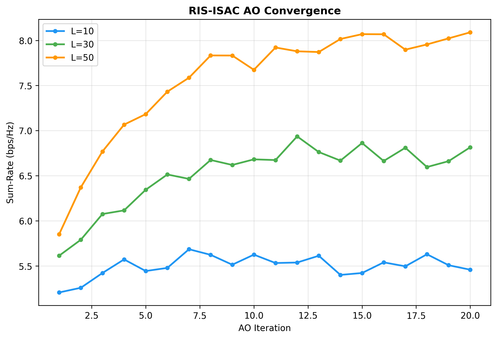
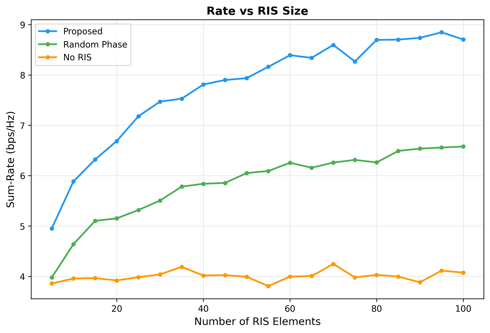
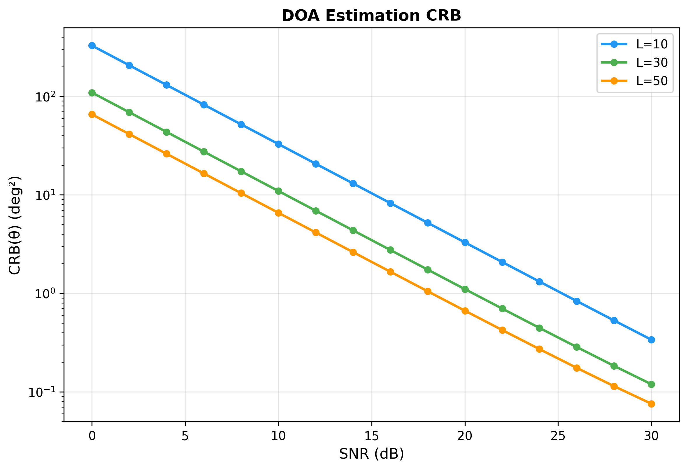

# RIS-ISAC Joint Beamforming & Reflection Design

> Joint optimization of BS beamforming and RIS phase shifts for simultaneous radar sensing and multi-user communications, under SNR or CRB constraints.
>
> 📄 **Paper**: R. Liu, H. Li, Y. Li, C. Huang, D. K. C. So, X. You, "SNR/CRB-Constrained Joint Beamforming and Reflection Designs for RIS-ISAC Systems," *IEEE Trans. Wireless Commun.*, 2024. [arXiv:2301.11134](https://arxiv.org/abs/2301.11134) | [IEEE Xplore](https://ieeexplore.ieee.org/document/10385889)
>
> ✅ **Status**: All tests passing


---

## 🎯 What This Implements

Reconfigurable Intelligent Surfaces (RIS) can shape the wireless propagation environment by adjusting passive reflective elements. In an RIS-assisted ISAC system, a multi-antenna base station (BS) communicates with multiple users while simultaneously using the same transmitted waveforms to sense a target — all mediated by a passive RIS with tunable phase shifts.

This baseline implements **two joint optimization formulations** for RIS-ISAC:

### Problem 1: SNR-Constrained (Target Detection)

Maximizes the communication sum rate subject to a minimum radar sensing SNR threshold γ_min:

```
max  Σ_k R_k                    (sum rate)
s.t. SNR_sensing ≥ γ_min        (detection requirement)
     SINR_k ≥ γ_k               (communication QoS per user)
     Σ_k ||w_k||² ≤ P_max      (total power budget)
     |θ_l| = 1, ∀l              (RIS unit-modulus)
```

### Problem 2: CRB-Constrained (Parameter Estimation)

Maximizes sum rate subject to an upper bound ε_max on the Cramér-Rao Bound for target angle estimation:

```
max  Σ_k R_k                    (sum rate)
s.t. CRB(φ) ≤ ε_max            (estimation accuracy)
     SINR_k ≥ γ_k               (communication QoS per user)
     Σ_k ||w_k||² ≤ P_max      (total power budget)
     |θ_l| = 1, ∀l              (RIS unit-modulus)
```

Both problems are non-convex (due to the RIS unit-modulus constraint and coupled channels) and solved via **Alternating Optimization (AO)**: the BS beamforming is optimized using SDR + WMMSE, while the RIS phases are optimized via grid-search coordinate ascent.

## 📊 Results


*Figure 1: AO algorithm convergence for different RIS element counts*


*Figure 2: Sum-rate vs number of RIS elements - Proposed method outperforms baselines*


*Figure 3: DOA estimation CRB vs SNR for different RIS sizes*

## 🚀 Quick Start

```bash
# 1. Clone and enter the baseline directory
cd code/baselines/ris_isac_beamforming

# 2. Create and activate virtual environment
python3 -m venv .venv
source .venv/bin/activate

# 3. Install dependencies
pip install -r requirements.txt

# 4. Run all tests
pytest tests/ -v
```

### Using the API

```python
import numpy as np
from src import RIS_ISAC_System, AlternatingOptimizationSolver

# Create system: 4 BS antennas, 2 users, 30 RIS elements
system = RIS_ISAC_System(M=4, K=2, L=30, seed=42)

# --- Problem 1: SNR-constrained (detection) ---
solver_snr = AlternatingOptimizationSolver(
    system, problem_type='snr', snr_min_dB=5.0
)
result_snr = solver_snr.solve()

print(f"Sum rate:     {result_snr['sum_rate']:.2f} bps/Hz")
print(f"Radar SNR:    {10*np.log10(result_snr['snr_sensing']):.1f} dB")
print(f"Converged:    {result_snr['converged']}")

# --- Problem 2: CRB-constrained (estimation) ---
system.reset_channels(seed=42)
solver_crb = AlternatingOptimizationSolver(
    system, problem_type='crb', crb_max=1e-2
)
result_crb = solver_crb.solve()

print(f"Sum rate: {result_crb['sum_rate']:.2f} bps/Hz")
print(f"CRB:      {result_crb['crb']:.2e}")
print(f"Power:    {result_crb['power_used']:.4f} / {system.P_max:.4f} mW")
```

### Evaluating a Solution

```python
# Evaluate custom beamforming & RIS phases
evaluation = solver_snr.evaluate(result_snr['W'], result_snr['theta'])
print(f"Per-user SINR: {evaluation['sinr_per_user']}")
print(f"Power used:    {evaluation['power_used']:.4f} mW")
```

## 📖 Mathematical Background

### System Model (Section III.A)

A BS with M = 4 antennas serves K = 2 single-antenna users through a passive RIS with L = 30 elements. The effective channel for user k combines the direct BS-to-user link and the RIS-mediated path:

$$\mathbf{h}_k = \mathbf{g}_k^H \boldsymbol{\Theta} \mathbf{H}_{BR} + \mathbf{h}_{d,k}^H$$

where:
- **H**_{BR} ∈ ℂ^{L×M} is the BS-to-RIS channel
- **G** ∈ ℂ^{K×L} contains the RIS-to-user channels (each row g_k^H)
- **h**_{d,k} ∈ ℂ^{M} is the direct BS-to-user channel
- **Θ** = diag(θ₁, …, θ_L) is the RIS diagonal matrix with |θ_l| = 1

### Channel Model (Rician Fading)

All channels follow Rician fading with factor K_R = 3:

$$\mathbf{H} = \sqrt{\frac{K_R}{K_R+1}}\,\mathbf{H}_{\text{LoS}} + \sqrt{\frac{1}{K_R+1}}\,\mathbf{H}_{\text{NLoS}}$$

The LoS component uses uniform linear array (ULA) geometry with far-field plane-wave propagation:

$$a(\phi) = [1,\; e^{j\pi\sin\phi},\; \ldots,\; e^{j(N-1)\pi\sin\phi}]^T$$

### Communication Metrics (Eq. 4–5)

**SINR** for user k:

$$\text{SINR}_k = \frac{|\mathbf{h}_k^H \mathbf{w}_k|^2}{\sum_{j \neq k} |\mathbf{h}_k^H \mathbf{w}_j|^2 + \sigma^2}$$

**Sum rate**:

$$R_{\text{sum}} = \sum_{k=1}^{K} \log_2(1 + \text{SINR}_k)$$

### Radar Sensing (Eq. 6)

The sensing channel combines the direct BS-to-target path and the RIS-mediated round trip:

$$\mathbf{h}_s = \mathbf{a}_{BS} + \mathbf{a}_{RIS}^T \boldsymbol{\Theta} \mathbf{H}_{BR}$$

**Sensing SNR**:

$$\text{SNR}_s = \frac{|\mathbf{h}_s^H \mathbf{w}|^2}{\sigma^2}$$

where **w** = Σ_k **w**_k is the total beamforming vector.

### CRB for Angle Estimation

The CRB for target angle φ estimation:

$$\text{CRB}(\phi) = \frac{\sigma^2}{2\,|\mathbf{d}_s^H \mathbf{w}|^2}$$

where **d**_s = ∂**h**_s/∂φ is the derivative of the sensing channel with respect to the target angle.

### Alternating Optimization Algorithm

```
Input: Channels, power budget P_max, SINR/SNR thresholds
Output: W*, θ*

1. Initialize θ (sensing-optimal) and W (matched filter)
2. Repeat:
   a. Fix θ → Optimize W via WMMSE + SDR
      - MMSE receivers: u_k, weights α_k
      - SDR subproblem: min Σ_k α_k·e_k s.t. SINR, SNR/CRB, power
      - Recover W from rank-1 dominant eigenvector
   b. Fix W → Optimize θ via coordinate ascent
      - Grid search over 16 candidate phases per element
      - Maximize sum rate (or sensing objective)
3. Until convergence (|Δrate| < tol·|rate|)
```

### Solver Fallback

Both MOSEK (commercial) and SCS (open-source) solvers are supported. The code automatically falls back from MOSEK to SCS if unavailable — no configuration needed.

## 🏗️ Project Structure

```
ris_isac_beamforming/
├── configs/
│   └── default.yaml              # Table I parameters (antennas, power, thresholds)
├── src/
│   ├── __init__.py               # Package exports
│   ├── system_model.py           # RIS-ISAC system: channels, SINR, SNR, rate
│   ├── channel_model.py          # Rician fading channels with ULA geometry
│   ├── beamforming.py            # SDR + WMMSE beamforming optimizer
│   ├── ris_phase.py              # RIS phase optimization (coordinate ascent)
│   ├── snr_constraint.py         # Problem P1: SNR-constrained solver
│   ├── crb_constraint.py         # Problem P2: CRB-constrained solver
│   └── ao_solver.py              # Unified AO interface (dispatches to P1/P2)
├── tests/
│   ├── test_system.py            # System model & channel tests
│   ├── test_beamforming.py       # Beamforming optimization tests
│   ├── test_ris_phase.py         # RIS unit-modulus & optimization tests
│   ├── test_snr.py               # SNR constraint enforcement tests
│   ├── test_crb.py               # CRB constraint & computation tests
│   └── test_ao_solver.py         # AO convergence & solution tests
├── examples/
│   └── demo.ipynb                # Interactive demo notebook
├── requirements.txt              # numpy, scipy, cvxpy, matplotlib
└── README.md                     # This file
```

## 📚 References

```bibtex
@article{liu2024snr,
  title   = {{SNR/CRB}-Constrained Joint Beamforming and Reflection Designs for {RIS-ISAC} Systems},
  author  = {Liu, Rang and Li, Hui and Li, Youjia and Huang, Chongwen and So, Daniel K. C. and You, Xiaohu},
  journal = {IEEE Transactions on Wireless Communications},
  year    = {2024},
  doi     = {10.1109/TWC.2024.3361589}
}
```

### Key Dependencies

| Package | Purpose |
|---------|---------|
| **CVXPY** | Convex optimization modeling (SDR subproblems) |
| **NumPy** | Array operations, channel generation |
| **SciPy** | Matrix decompositions, statistical functions |
| **Matplotlib** | Figure generation (optional) |

### System Parameters (Table I)

| Parameter | Symbol | Value |
|-----------|--------|-------|
| BS antennas | M | 4 |
| UE antennas | N | 2 |
| Data streams | d | 2 |
| Users | K | 2 |
| RIS elements | L | 10–50 (default: 30) |
| Max power | P_max | 10 mW |
| SINR threshold | γ_k | 10 dB |
| SNR threshold | γ_min | 5 dB |
| CRB bound | ε_max | 10⁻² |
| Bandwidth | B | 1 MHz |
| Noise power | σ² | 3.98 × 10⁻¹² mW |
| Rician factor | K_R | 3 |
