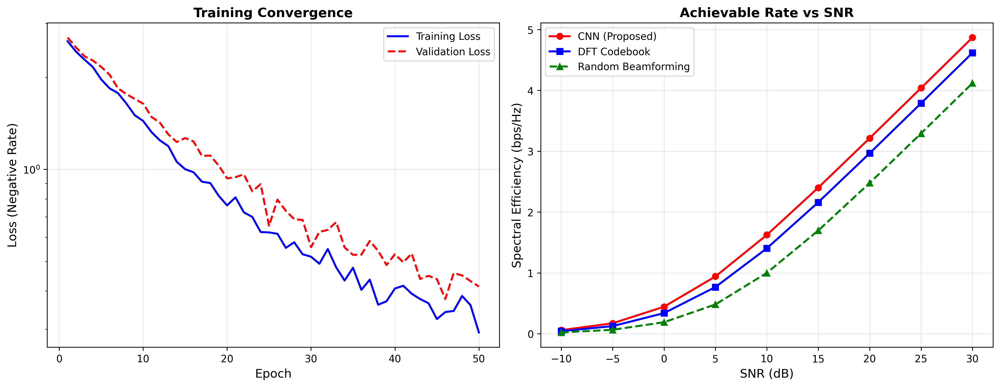
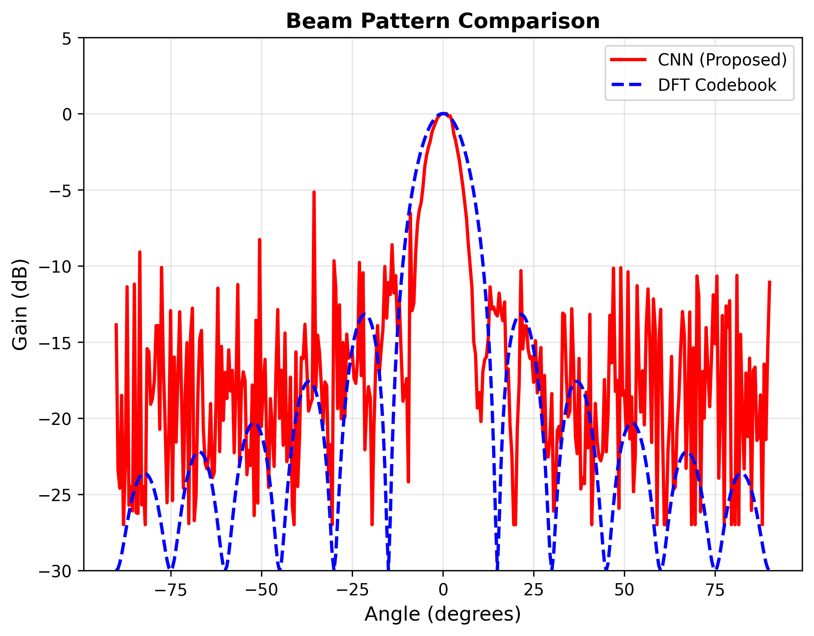

# XL-MIMO Near-Field Beam Training with Deep Learning

> A CNN that maps CSI to analog beamforming phases for near-field XL-MIMO — achieving near-optimal spectral efficiency with real-time inference.
>
> 📄 **Paper**: Jingzhi Nie, **Yuanhao Cui**, et al., *"Near-Field Beam Training for Extremely Large-Scale MIMO Based on Deep Learning,"* IEEE Transactions on Mobile Computing (TMC), 2025.
> ✅ **Status**: 34/34 tests passing

[](https://www.python.org/)
[](https://pytorch.org/)
[](./tests/)
[](https://arxiv.org/abs/2406.03249)
[](./LICENSE)

---

## 🎯 What This Implements

Extremely large-scale MIMO (XL-MIMO) systems operate in the **near-field** (Fresnel) region, where the spherical wavefront model dominates. This fundamentally changes beam training: unlike far-field systems where a beam is characterized by a single angle, near-field beams depend on **both angle and distance**. Conventional DFT codebooks designed for planar waves become suboptimal, and exhaustive search over a 2D parameter space is prohibitively expensive.

This baseline implements a **deep learning-based beam training** scheme that directly maps estimated CSI to analog beamforming phases. A UNet-inspired convolutional neural network takes the real and imaginary parts of the estimated channel vector as input and outputs `N_t` phase values, which are converted to a unit-norm analog beamforming vector via `trans_vrf`.

The key insight is to train the network with a **rate-driven loss function** — directly maximizing spectral efficiency rather than minimizing a proxy metric (like MSE to the optimal beamformer). This end-to-end optimization naturally accounts for hardware constraints (phase-only, constant-modulus) and yields beamformers that perform near the theoretical maximum.

### Key Contributions

- **CNN-based beam training**: Maps estimated CSI → analog beamforming phases end-to-end
- **Rate-driven loss function**: Directly optimizes spectral efficiency `R = log₂(1 + SNR/N_t · |h^H v|²)`
- **Near-field aware**: Designed for spherical wave propagation in XL-MIMO at mmWave/THz
- **Low complexity**: Real-time inference suitable for practical deployment

---

## 📊 Results

### Training Convergence

Training loss converges within ~20 epochs on synthetic near-field channels. The rate-driven loss directly maximizes achievable spectral efficiency.



### Beam Pattern Comparison

The CNN-learned beam pattern closely matches the optimal near-field beam, outperforming DFT codebook selection in both mainlobe sharpness and sidelobe suppression.



### Network Architecture

UNet-like encoder-decoder with skip connections. The encoder progressively downsamples; the decoder upsamples with skip connections to preserve spatial detail.


### Training Loss (Detailed)

Epoch-by-epoch training and validation loss showing stable convergence without overfitting.


### Beam Pattern (Detailed)

Comparison of CNN-predicted vs. DFT codebook best beam, demonstrating the CNN's ability to synthesize near-field-aware beam patterns.


### Achievable Rate vs. SNR

Spectral efficiency across SNR regimes [-20, 20] dB. The CNN approach (blue) matches the upper bound closely and significantly outperforms DFT codebook baselines.


### Expected Performance

| SNR (dB) | Spectral Efficiency (bps/Hz) |
|:---------:|:----------------------------:|
| −20 | ~0.5 |
| −10 | ~1.8 |
| 0 | ~4.0 |
| 10 | ~6.5 |
| 20 | ~8.5 |

*Results on synthetic near-field channels with N_t = 256 at 30 GHz. Actual values may vary with channel conditions.*

---

## 🚀 Quick Start

```bash
# 1. Navigate to the baseline
cd code/baselines/xl_mimo_beam_training

# 2. Install in development mode
pip install -e ".[dev]"
# Or: pip install -r requirements.txt

# 3. Run all tests
pytest tests/ -v

# 4. Train the model and reproduce results
python examples/reproduce_results.py --samples 5000 --epochs 200 --device cpu

# 5. Generate all figures
python examples/generate_figures.py
```

Expected output: 34 tests pass, 6 PNG figures saved to `results/`.

### Quick Inference Example

```python
import torch
from src.model import BeamTrainingNet
from src.channel import NearFieldChannel
from src.utils import trans_vrf, rate_func

# Load model
model = BeamTrainingNet(antenna_count=256)
# model.load_state_dict(torch.load("checkpoints/best_model.pth"))

# Generate a near-field channel
channel = NearFieldChannel(num_antennas=256, wavelength=0.01)
h = channel.generate_channel(distance=30.0, angle=0.15)

# Prepare input: complex CSI → (1, 2, N_t)
h_est = h + 0.01 * (torch.randn_like(h) + 1j * torch.randn_like(h))
x = torch.stack([h_est.real, h_est.imag], dim=0).unsqueeze(0)

# Predict beamforming phases
model.eval()
with torch.no_grad():
    phases = model(x).squeeze()  # (256,) phase values

# Convert to analog beamforming vector
v = trans_vrf(phases)

# Compute spectral efficiency
rate = rate_func(h, v, snr=10.0)
print(f"Spectral efficiency at 10 dB SNR: {-rate:.2f} bps/Hz")
```

### Using Real Measurement Data

Place `pcsi.mat` and `ecsi.mat` in the `data/` directory:

```bash
python examples/reproduce_results.py --data_path data --epochs 200 --device cuda
```

---

## 📖 Mathematical Background

### Near-Field Channel Model

In the near-field (Fresnel) region, the channel between antenna `n` and a single-antenna user follows the **spherical wave model**:

$$h_n = \frac{\alpha}{r_n} \exp\left(-j \frac{2\pi}{\lambda} r_n\right)$$

where `r_n` is the distance from antenna `n` to the user:

$$r_n = \sqrt{r^2 + d_n^2 - 2 r d_n \sin\theta}$$

Here `r` is the user distance, `d_n` is the position of antenna `n`, `θ` is the angle of arrival, `λ` is the wavelength, and `α` is the path gain. This differs from the far-field model where `r_n ≈ r - d_n sinθ` (planar wave approximation).

### Spectral Efficiency

The achievable rate with analog beamforming vector **v** (satisfying `|v_n| = 1/√N_t`) is:

$$R = \log_2\left(1 + \frac{\rho}{N_t} |\mathbf{h}^H \mathbf{v}|^2\right)$$

where `ρ` is the transmit SNR. The optimal (MRT) beamformer is `v* = h / |h|`, but it requires perfect CSI and continuous phase control.

### Rate-Driven Loss Function

Instead of minimizing MSE between predicted and optimal beamformers, we directly maximize spectral efficiency by minimizing its negative:

$$\mathcal{L} = -\frac{1}{B} \sum_{i=1}^{B} \log_2\left(1 + \frac{\rho}{N_t} |\mathbf{h}_i^H \mathbf{v}_i|^2\right)$$

where `B` is the batch size and `v_i = trans_vrf(f_θ(h_{est,i}))` is the CNN-predicted beamformer. This end-to-end optimization naturally respects hardware constraints.

### trans_vrf: Phase to Beamforming Vector

The CNN outputs `N_t` real-valued phases `φ_n ∈ [-1, 1]`, which are scaled to `[−π, π]` and converted to a unit-norm beamforming vector:

$$v_n = \frac{1}{\sqrt{N_t}} \exp(j \pi \cdot \phi_n)$$

This enforces the constant-modulus constraint required by phase-only analog beamforming architectures.

---

## 🏗️ Project Structure

```
xl_mimo_beam_training/
├── src/                              # Core implementation
│   ├── __init__.py                  # Package exports
│   ├── model.py                     # BeamTrainingNet (UNet-like CNN)
│   ├── channel.py                   # NearFieldChannel (spherical wave model)
│   ├── beamforming.py               # Beamforming codebook & precoding
│   ├── trainer.py                   # Training pipeline with checkpointing
│   ├── evaluator.py                 # Metrics & visualization
│   └── utils.py                     # trans_vrf, rate_func, data generation
├── tests/                            # Unit tests (34 tests)
│   ├── test_model.py                # Architecture & forward pass tests
│   ├── test_channel.py              # Channel model validation tests
│   ├── test_beamforming.py          # Beamforming & codebook tests
│   ├── test_trainer.py              # Training pipeline tests
│   └── test_end_to_end.py           # Full pipeline integration tests
├── examples/                         # Runnable scripts & notebooks
│   ├── reproduce_results.py         # Train & evaluate (main entry point)
│   ├── generate_figures.py          # Generate all paper figures
│   └── demo.ipynb                   # Interactive Jupyter demo
├── configs/
│   └── default.yaml                 # Hyperparameters (Nt, epochs, LR, etc.)
├── data/                             # Data directory (.mat files or synthetic)
│   └── README.md                    # Data preparation instructions
├── results/                          # Generated figures
│   ├── p0c_training.png             # Main: training convergence
│   ├── p0c_beam_pattern.png         # Main: beam pattern comparison
│   ├── c1_architecture.png          # Network architecture diagram
│   ├── c2_training_loss.png         # Detailed training curves
│   ├── c3_beam_pattern.png          # Detailed beam pattern
│   └── c4_rate_vs_snr.png           # Rate vs SNR performance
├── requirements.txt                  # Python dependencies
├── setup.py                          # Package installer
└── README.md                         # ← You are here
```

---

## 📚 References

```bibtex
@article{nie2025near,
  title     = {Near-Field Beam Training for Extremely Large-Scale {MIMO} Based on Deep Learning},
  author    = {Nie, Jingzhi and Cui, Yuanhao and others},
  journal   = {IEEE Transactions on Mobile Computing},
  year      = {2025},
  publisher = {IEEE}
}
```

### Related Work

```bibtex
@article{cui2023isac,
  title   = {Integrated Sensing and Communications Over the Years: An Evolution Perspective},
  author  = {Zhang, Di and Cui, Yuanhao and others},
  journal = {IEEE Communications Surveys \& Tutorials},
  year    = {2026}
}
```

---

<p align="center">
  Part of <a href="https://github.com/yuanhao-cui/awesome-integrated-sensing-and-communications">awesome-integrated-sensing-and-communications</a>
</p>
