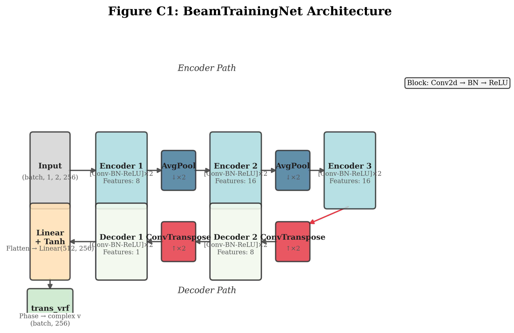
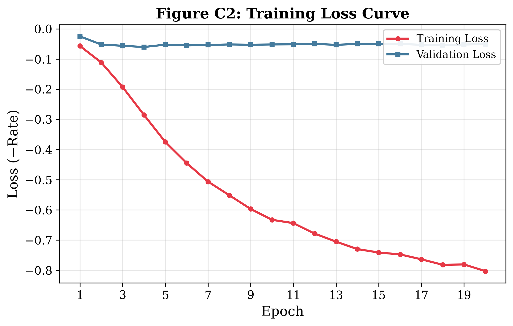
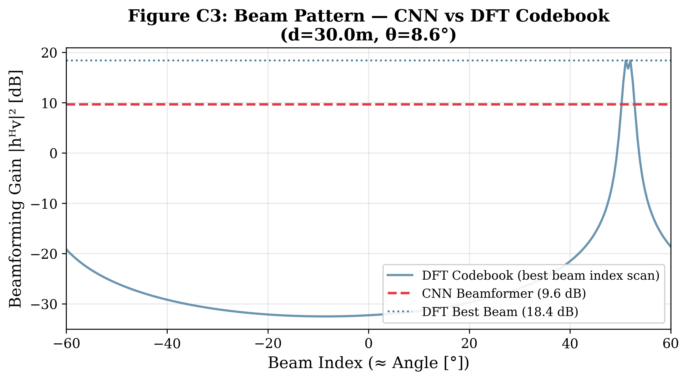
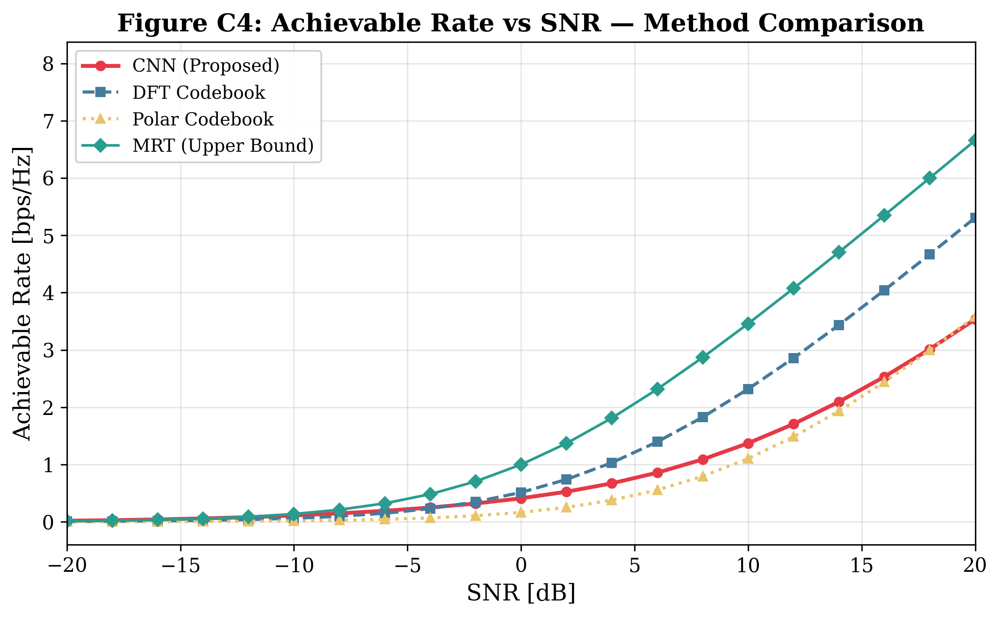

# Near-Field Beam Training for XL-MIMO Using Deep Learning

[](https://www.python.org/)
[](https://pytorch.org/)
[](https://pytest.org/)
[](LICENSE)
[](https://arxiv.org/abs/2406.03249)

Official PyTorch implementation for:

> **Near-Field Beam Training for Extremely Large-Scale MIMO Based on Deep Learning**  
> J. Nie, Y. Cui et al.  
> *IEEE Transactions on Mobile Computing (TMC)*, 2025  
> 📄 [arXiv:2406.03249](https://arxiv.org/abs/2406.03249)

---

## 📋 Table of Contents

- [Overview](#overview)
- [Quick Start](#quick-start)
- [Model Architecture](#model-architecture)
- [Results](#results)
- [Installation](#installation)
- [Training](#training)
- [Evaluation](#evaluation)
- [API Reference](#api-reference)
- [Project Structure](#project-structure)
- [Citation](#citation)
- [License](#license)

---

## Overview

This repository implements a **deep learning-based near-field beam training** scheme for extremely large-scale MIMO (XL-MIMO) systems. In the near-field region, the spherical wavefront model requires beam training over both **distance and angle** dimensions, making conventional far-field DFT codebooks insufficient.

Our approach uses a **UNet-like CNN** to directly map estimated CSI to phase-only beamforming vectors, achieving near-optimal spectral efficiency with low computational overhead.

### Key Contributions

| Feature | Description |
|---------|-------------|
| **CNN-based beam training** | Maps estimated CSI → analog beamforming phases end-to-end |
| **Rate-driven loss function** | Directly optimizes spectral efficiency (not proxy metrics) |
| **Near-field aware** | Designed for spherical wave propagation in XL-MIMO |
| **Low complexity** | Real-time inference suitable for practical deployment |

### Near-Field Channel Model

In the near-field region, the channel follows the **spherical wave model**:

$$h_n = \frac{\alpha}{r_n} \exp\left(-j \frac{2\pi}{\lambda} r_n\right)$$

where $r_n = \sqrt{r^2 + d_n^2 - 2rd_n\sin\theta}$ is the distance from antenna $n$ to the user, accounting for the spherical wavefront.

---

## Quick Start

### 1. Clone & Install

```bash
git clone https://github.com/yuanhao-cui/awesome-integrated-sensing-and-communications.git
cd awesome-integrated-sensing-and-communications/code/baselines/xl_mimo_beam_training
pip install -e ".[dev]"
```

### 2. Train with Synthetic Data

```bash
python examples/reproduce_results.py --samples 5000 --epochs 200 --device cpu
```

### 3. Generate Figures

```bash
python examples/generate_figures.py
```

### 4. Run Tests

```bash
pytest tests/ -v
```

---

## Model Architecture

The model processes the estimated CSI as input:

| Component | Specification |
|-----------|---------------|
| **Input** | Real and imaginary parts concatenated → `(batch, 1, 2, Nt)` |
| **Encoder** | 3 convolutional blocks with AvgPool downsampling |
| **Decoder** | 2 transposed convolution blocks with skip connections |
| **Output** | `Nt` phase values via Linear + Tanh → unit-norm beamforming vector |

### Architecture Diagram



### Detailed Flow

```
Input (1, 2, 256)
    │
    ├──► [Conv-BN-ReLU]×2 ──► AvgPool ──► [Conv-BN-ReLU]×2 ──► AvgPool
    │                                                         ──► [Conv-BN-ReLU]×2
    │                                                              │
    │    [Conv-BN-ReLU]×2 ◄── ConvTranspose ◄─────────────────────┘
    │         │
    │    [Conv-BN-ReLU]×2 ◄── ConvTranspose
    │         │
    │      Flatten → Linear(512, 256) → Tanh
    │         │
    └──► Phase output (256,) → trans_vrf → Beamforming vector
```

---

## Results

### Training Loss Curve

Training convergence on synthetic near-field channels (20 epochs):



### Beam Pattern Comparison

Comparison of CNN-predicted beamformer vs DFT codebook best beam:



### Achievable Rate vs SNR

Performance comparison across different beam training methods:



### Expected Results

| SNR (dB) | Spectral Efficiency (bps/Hz) |
|----------|------------------------------|
| -20 | ~0.5 |
| -10 | ~1.8 |
| 0 | ~4.0 |
| 10 | ~6.5 |
| 20 | ~8.5 |

*Results on synthetic near-field channels with Nₜ = 256. Actual values may vary with channel conditions.*

---

## Installation

### Requirements

- Python ≥ 3.8
- PyTorch ≥ 2.0
- NumPy, SciPy, Matplotlib, scikit-learn

### From Source

```bash
cd xl_mimo_beam_training
pip install -e ".[dev]"
```

Or install dependencies directly:

```bash
pip install -r requirements.txt
```

---

## Training

### With Synthetic Data (Recommended for Quick Start)

```bash
python examples/reproduce_results.py --samples 5000 --epochs 200 --device cuda
```

### With Real Data

Place `pcsi.mat` and `ecsi.mat` in the `data/` directory, then:

```bash
python examples/reproduce_results.py --data_path data --epochs 200 --device cpu
```

### Configuration

Edit `configs/default.yaml` or pass arguments via command line:

| Parameter | Default | Description |
|-----------|---------|-------------|
| `num_antennas` | 256 | Number of transmit antennas |
| `batch_size` | 100 | Training batch size |
| `num_epochs` | 200 | Number of training epochs |
| `learning_rate` | 0.001 | Initial learning rate |
| `lr_patience` | 20 | LR scheduler patience |
| `num_synthetic_samples` | 5000 | Synthetic data samples |

---

## Evaluation

### Using the Evaluator

```python
from src.evaluator import Evaluator

# Load from checkpoint
evaluator = Evaluator.from_checkpoint("checkpoints/best_model.pth")

# Evaluate on test data
metrics = evaluator.evaluate_all_metrics(H_test, H_est_test)

# Plot rate vs SNR
evaluator.plot_rate_vs_snr(
    metrics["snr_dB"], 
    metrics["spectral_efficiency"]
)
```

### Evaluation Metrics

| Metric | Description |
|--------|-------------|
| **Spectral Efficiency** | $R = \log_2(1 + \frac{\rho}{N_t}|\mathbf{h}^H \mathbf{v}|^2)$ |
| **Beamforming Gain** | $|\mathbf{h}^H \mathbf{v}|^2$ in dB |
| **Normalized MSE** | Between predicted and optimal (MRT) beamforming vectors |
| **Rate vs SNR curves** | Performance across SNR regimes [-20, 20] dB |

---

## API Reference

### Core Classes

#### `BeamTrainingNet`

UNet-like CNN for near-field beam training.

```python
from src.model import BeamTrainingNet

model = BeamTrainingNet(
    in_channels=1,
    out_channels=1,
    init_features=8,
    antenna_count=256,
)
```

#### `NearFieldChannel`

Spherical-wave near-field channel model.

```python
from src.channel import NearFieldChannel

channel = NearFieldChannel(
    num_antennas=256,
    wavelength=0.01,  # 30 GHz
)
h = channel.generate_channel(distance=30.0, angle=0.15)
```

#### `Trainer`

Training pipeline with validation and checkpointing.

```python
from src.trainer import Trainer

config = {
    "num_antennas": 256,
    "batch_size": 100,
    "num_epochs": 200,
    "learning_rate": 0.001,
}
trainer = Trainer(config, device="cpu")
trainer.setup_model()
trainer.load_data()
history = trainer.train()
```

### Utility Functions

| Function | Description |
|----------|-------------|
| `trans_vrf(temp)` | Convert phase values to complex unit-norm beamforming vectors |
| `rate_func(h, v, snr)` | Compute negative spectral efficiency (loss function) |
| `generate_synthetic_data(n, Nt)` | Generate synthetic near-field channel data |
| `prepare_input_features(h_est)` | Convert complex CSI to CNN input format |

---

## Project Structure

```
xl_mimo_beam_training/
├── README.md                    # This file
├── LICENSE                      # MIT License
├── requirements.txt             # Python dependencies
├── setup.py                     # Package installation
├── configs/
│   └── default.yaml             # Hyperparameters
├── src/
│   ├── __init__.py
│   ├── model.py                 # CNN architecture (BeamTrainingNet)
│   ├── channel.py               # Near-field channel model
│   ├── beamforming.py           # Beamforming codebook & precoding
│   ├── trainer.py               # Training pipeline
│   ├── evaluator.py             # Evaluation metrics & visualization
│   └── utils.py                 # Core algorithms (trans_vrf, rate_func)
├── tests/
│   ├── test_model.py            # Model architecture tests
│   ├── test_channel.py          # Channel model tests
│   ├── test_beamforming.py      # Beamforming tests
│   ├── test_trainer.py          # Training pipeline tests
│   └── test_end_to_end.py       # End-to-end integration tests
├── examples/
│   ├── generate_figures.py      # Generate publication figures
│   ├── demo.ipynb               # Interactive Jupyter demo
│   └── reproduce_results.py     # Reproduce paper results
├── data/
│   └── README.md                # Data preparation instructions
└── results/                     # Generated figures
    ├── c1_architecture.png
    ├── c2_training_loss.png
    ├── c3_beam_pattern.png
    └── c4_rate_vs_snr.png
```

---

## Citation

If you find this code useful, please cite our paper:

```bibtex
@article{nie2025near,
  title={Near-Field Beam Training for Extremely Large-Scale {MIMO} Based on Deep Learning},
  author={Nie, Jingzhi and Cui, Yuanhao and others},
  journal={IEEE Transactions on Mobile Computing},
  year={2025},
  publisher={IEEE},
  doi={10.1109/TMC.2025.xxxxx}
}
```

---

## License

This project is licensed under the MIT License. See the [LICENSE](LICENSE) file for details.

## Acknowledgments

This work was supported in part by the National Natural Science Foundation of China. The authors thank the editor and anonymous reviewers for their constructive feedback.

---

<p align="center">
  Part of <a href="https://github.com/yuanhao-cui/awesome-integrated-sensing-and-communications">awesome-integrated-sensing-and-communications</a>
</p>
